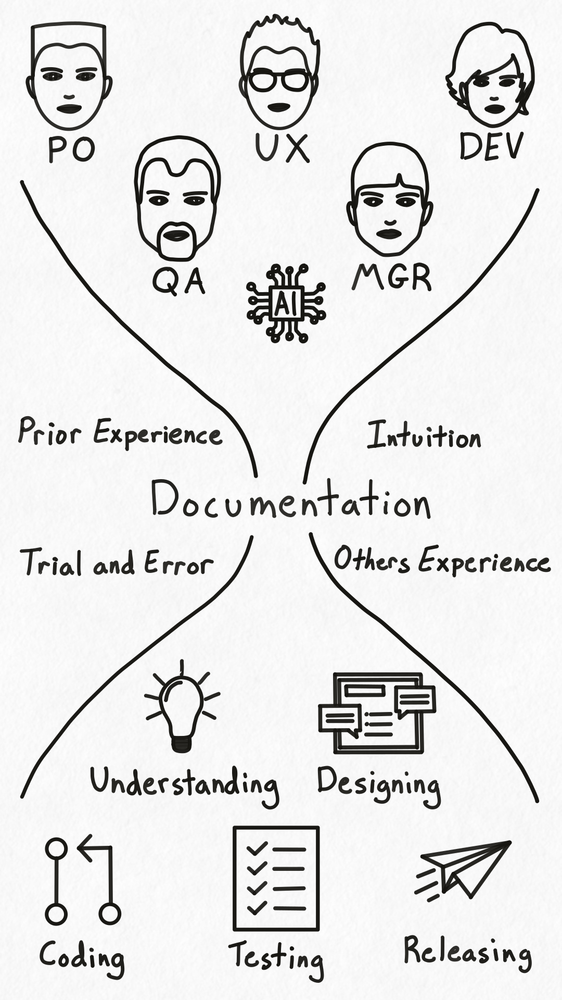

Landscape
1080/3 = 360h
1920/3 = 640v

Square
1080/3 = 360h
1080/3 = 360w

Portrait
1920/3 = 640v
1080/3 = 360h

Font Size: 16*3 = 48px

# Purpose of Documentation
TODO use goals or objectives?

In the process of developing software products we have many different people involved. Product owners, product managers, and designers; developers, engineers, and qa; team leads, program mangers, and stakeholders; all are working toward a set of goals. These goals are varied and often overlap. Some examples include drafting product designs and plans, designing user interfaces and flows, writing code and developing software, testing products and releasing them, and understanding what everyone is doing and who is responsible for what. And the common element/thing that enables each person to reach their goals is the knowledge of how to perform the process(es) that lead to their goals. This knowledge can be in many forms, such as having done it before, asking someone else how to do it, intuition, trial and error, reading through what others have done before, etc. But of all of the available options, one of the quickest and most cost effective ways is reading a document describing the process of how to accomplish that goal. And the set of documents that contain the knowledge of how to accomplish those goals is called documentation. Stated another way, the **purpose of documentation is to help people achieve their goals**.

And the purpose of documentation is not limited to just people anymore. With the general availability of large language models and specialized agents, the purpose of documentation has been expanded to help people __and AI__ achieve their goals.

# Persons to Personas

## Example(s)

# Grouping your Goals

## Example(s)

# Deciding on Documentation

## Example(s)

# Weighing the Costs

## Example(s)

# Writing with Purpose

## Example(s)

# You Can Do It!? (Something else here)

# The Purpose of Documentation
An explanation of why every piece of documentation needs a purpose

# Introduction
If you are a developer you have undoubtedly either heard or uttered the words "don't forget to update the documentation".
We as developers understand the usefulness of good documentation, and enjoy it when it is present. Likewise we feel the sting of a lack of documentation, especially when the human counterpart for that information is missing or otherwise unavailable.
For the most part engineers and companies agree that documentation is good, and that we need more of it. But just like having "more |food| isn't necessarily good when we're hungry, just creating more documentation isn't necessarily good either. We need to create the _right kind(s)_ of documentation. And how do we do that? By understanding the purpose of our documentation and creating/writing our documentation to fit that purpose.

# Purpose
TODO image here
Put simply, the purpose of documentation is to enable a person to accomplish their objective. That's it. So let's break that down.

### Objective
Let's start with the objective. There is something that needs to get done. This could be as straightforward as setting the interest rate in a bank back office system to change on a specific day, or as nebulous as a product manager trying to figure out how feasible it is to add a new feature by some deadline TODO pick better examples.
Usually we will be able to identify groups of objectives that naturally go together, like the objective of understanding the meaning and context of field X in API endpoint |alpha| can be grouped with the objective of understanding the meaning and context of field Y in API endpoint |alpha|. And it would make sense that those objectives would be closely tied with the objective of calling API endpoint |alpha|.
Once useful thing to do with objectives is to group them under a higher, more abstract title. For the example above the more abstract objective could be "understand the request and response context and format so someone can call API endpoint |alpha|.
And you will immediately notice that we need to understand who that someone could be, which leads us to...

### Person(a)s
Once we have an understanding of our objectives, we need to understand the person or persons that will be attempting to complete that objective. Who are they? What do they know? How deep is their understanding of the objective and how to complete it? Do they already know how to complete it? etc...
Taking these people and grouping them together into common buckets is called creating a Persona. A Persona is TODO |definition and citation|. And once you have a set of personas for each (group of) objectives you can start thinking about what documentation they need.

### Documentation
Now that we have a set of objectives and a list of persona(s) for each objective, we can begin to think about what documentation should/needs to exist. We can ask ourselves the question "What does person(a) X need to know to accomplish objective Y"? That's it. The answer to that question is what you need to include in your documentation.

# Creating Documentation
You may have noticed that there are almost infinite people and objectives for which we _could_ create documentation for, so how do we choose what to create?
The tldr is that you need to perform a cost and risk analysis comparing the cost to create and update the documentation with the cost of any and all alternatives as compared to the risk(s) posed by each alternative. What do we mean by alternatives? Let's take for example the scenario where a manager needs to update the interest rate for a product in a back-office system. Option 1 is creating a very granular how-to document that goes step-by-step of exactly what to do, including screenshots. Option 2 is to rely on the experience of the manager to know generally what to do and provide documentation that provides a simple high-level check-list and a link to the back-office documentation. Option 3 (not recommended) is to have no documentation or written procedure, and rely on the internal knowledge of the manager to complete the task. Each of these options comes with costs, both to create the documentation and the cost(s) associated with a failure to meet the objective.

* Option 1 - Cost: Higher initial cost to create the documentation and a higher cost to update if the back-office system is changed. Risk: Relatively low as long as the documentation is complete, accurate, and is followed exactly.
* Option 2 - Cost: Lower initial cost to create and much lower cost to maintain. Risk: The likelihood of a mistake (especially for a manager with less experience or knowledge) is higher.
* Option 3 - Cost: The lowest possible cost. Risk: The highest risk among the 3 options.

Also note that if we have more than one Persona we would need to do this for each Persona (the risk in the example above will be lower for an experienced expert vs a new employee completing this task for the first time). Sometimes it is worth accepting the risk for a set of Personas to decrease the cost of documentation, or by preventing certain personas from attempting to complete the objective by themselves or at all (until they gain experience and then fit the persona the documentation is created for)

This might sound onerous, but once you have a set of high-level personas and objectives compiled the addition of another persona and/or objective is relatively low. And this also does not have to be highly rigorous or detailed. It could be as straightforward as using the roles already within the company and focusing on a small set of high-level or abstract objectives. The main purpose and use is to provide the context and framework for having productive discussions around what to document (or not) within an organization. 

# Bringing it all together
We've talked about what documentation is and how to go about deciding what documentation to create. Now let's touch on the original purpose of this article: why does every piece of documentation need a purpose. Again, the answer is two-fold: 1) to help those creating/maintaining create documentation that actually helps the persona(s) achieve their objective(s), and 2) to provide the context necessary to get the granularity correct based on the cost(s) of maintaining the documentation and the risks that the documentation is working to address.

So when you hear the words "don't forget to update the documentation", you should hopefully be able to understand what documentation they are referring to, and you should be equipped with the ability to talk about the purpose of that documentation to make sure it is updated to meet that purpose.

* Context
  * People are just trying to do things, and they have (or need to have) the know how of how to do it
  * How do we acquire the know how? experience or external, for external, people, bots, or docs
* Documentation
  * Show diagram
  * > (for the sake of our purposes here) In tech, the purpose of documentation is the asynchronous transmission of the knowledge a person needs to accomplish their objective.
  * Knowledge
    * Define knowledge (via >)
    * Point out that you may already have that knowledge, can acquire it through experience/trial/error, can acquire it via other people, or can acquire it via documentation
  * Person(a)
    * Define persona (via >)
  * Objective
    * Define objective (via >)
* Create(ing) Your Documentation with Purpose
  * You can create documentation however you want, but it helps to start with a purpose and build from there
  * Purpose
    * What are your objectives
    * What are your personas
    * What documentation do you need

# Purpose
* Have you ever witnessed a conversation where someone says “make sure to update the documentation”, and then …
* Purpose is defined as "the reason for which something is done or created or for which something exists". (Oxford Languages)
* Purpose is defined as “...”. Describe and define purpose and how we are using it here
* When we say purpose this is what we mean (for the sake of this article)

# The Purpose of Documentation?
TODO describe the purpose of documentation and what specific problem it is trying to achieve (usually to provide someone the means of doing something when they don't know or remember how to do it exactly?)

The purpose of documentation is to allow someone (persona) the ability to accomplish something (objective).

It is needed to scale and guard against the bus factor of people?

* Describe what happens when documentation does not have a purpose, or that it appears that it does not need a purpose
* What people think or are willing to do (or not do) based on it having a purpose (If I don’t see the purpose, or the point, I won’t bother doing it)

## Someone
TODO describe how we can thing of the someones as personas, and list out a few common personas. Note that the set of specific personas applicable to an organization and/or product are not universal, and that personas can and often are not just end users, but developers, team members, stakeholders, or other company individuals/roles.
In UX there is the concept of persona (link), or a fictional character meant to represent a set or group of people. In documentation the someone(s) referenced above can be thought of as a set of personas

* Thinking about documentation, there are 3 main categories of people involved: Directors, Producers, and Consumers
* Directors - will it solve problem x, will it return an ROI, is it worth it
* Producers - What do we need to document, and how
* Consumers - Will this document answer my question

## Something
TODO describe how we can think of these things as objectives that a persona is attempting to achieve, and the documentation is one way that we can help them achieve that. Note that once a person is adept at achieving a particular objective the relative value of the documentation is reduced for that person, but if a new person needs to complete that objective, or that objective has side effects or ways that it could go wrong or blow up, then documentation can serve to mitigate that particular item. 

## Documentation
Everything has a cost, and documentation is just a way to reduce that cost to a reasonable amount. The existence of documentation should be measured by the cost needed to create/maintain it vs the cost of the person trying (and maybe failing along the way) to achieve their objective. A good conversation to have about wether or not to document something is by taking your persona/objective pairs and looking at the cost (both real and felt) of completing the objective with and without documentation. There are times where a persona will almost never succeed without documentation (a jr dev trying to fix a bug in a complex distributed system), and other times where the documentation lowers the time/cost it takes to complete the objective (a sr dev who wrote the system trying to fix a bug in the complex distributed system). There are additional times where the documentation enables the objective to be completed accurately 100% of the time (assuming it is followed and is accurate), such as configuring the interest rate calculation tiers in a bank's back office software that affects potentially millions of accounts.

## Purpose
Once you have a pair of persona and objective, you have a purpose. Many times those purposes can be grouped together into larger general common buckets, and when you do this you end up with a purpose (i.e. persona/objective pair) that represents a larger set of persona/objective pairs. You now have purpose for your documentation.

# How to discover what documentation you need?
TODO discuss the process for discovering what documentation you need. You can start with either personas or objectives, but you will probably go back and forth between them during the process, discovering/splitting personas and listing out objectives. Once you have a list of personas and their objectives, you can start grouping them and seeing what overlaps. Many times the same piece of documentation can serve the same objective for more than one persona, especially if just a bit more detail is added in just the right places.

Once you have the list of persona/objective pairs, you can group them into documentation buckets and/or hierarchies. Each bucket will have a set of pairs associated with it, and if you rework and group them you can come up with a new persona/objective (at a higher level) that captures the purpose and the corresponding documentation.

Once you have this set of documentation defined you still need to go create it, but now you have a checklist that you can measure against: namely does this documentation allow persona to complete objective? If yes, done. If no, keep working. Note that there is nuance in this, as the ability to complete something vs the cost of maintaining something may change over time, but if you have the purpose of the documentation recorded somewhere it can be reviewed when things/the world changes.

Also note that you can have (and probably will have) hierarchies of documentation, where each level has a purpose and the smaller section's purpose support the larger section's purpose.

## Example 0: Run Locally section in a README

## Example 1: An internal Authentication API for a cross-platform app
TODO there is an API used to create accounts, Sign in/out, and manage usernames and passwords

TODO personas:

TODO objectives:

## Example 2: The recurring billing process for a SaaS
TODO do we need this example?

# How to discover the purpose of your existing documentation?
TODO Very similar to the process of discovering what documentation you need, discovering the purpose of your existing documentation involves the identification of personas and their objectives. For a particular document or set of documents, ask yourself who these documents are for (or if you have usage stats, go look). Write down that set of personas and then ask yourself what objectives does this documentation allow these people to achieve. The resulting list(s) will give you a sense of the purpose of your documentation, which may or may not match up to what purpose(s) you actually want the documentation to achieve. For example, if the purpose of some API documentation is to allow developers the ability to discover and use another team's internal APIs when building out systems and features but the documentation is inaccurate or incomplete and the developers are having to meet together and look over source code instead, the documentation may not be meeting its purpose and something needs to change (either the producing team keeps things complete and up to date, or the documentation is changed so that it directly references the source code so that consumers can readily find and read it, or the documentation is retired because the company deems the relative cost of maintaining the documentation higher than the cost/time required for developers to meet directly instead). All of these options may be valid at various times depending on the org and the relative costs/desires of the org (people/leadership) itself.

# Now What?
TODO you can use the purpose of documentation to get into the nuts and bolts of exactly _how_ you are going to enable a persona to achieve their objective(s) by looking at the documentation options available and how much that costs vs how much it benefits/enables that persona to complete that objective. You may find that some objectives are just not worth the cost and (hopefully) explicitly state that you are rejecting that objective, or you may limit the amount of documentation for particular purposes because the cost of maintaining the documentation is larger than the cost of that persona completing that objective without said documentation. Regardless of what you ultimately decide, you are now equipped to have the productive conversations in the context of your own products, systems, and organizations.

# Where to go from here
TODO by now you should understand that every piece of documentation should have a purpose, and that purpose should itself be documented somewhere. You should understand how to discover what documentation should exist, and how to evaluate existing documentation to divine its purpose. you should also be able to use this information to have some really good conversations with your peers/leaders/org about the cost of creating/maintaining documentation based on purpose and how to balance the cost vs the benefit by looking at the purpose (persona/objective pairs)

# Infographic(s)
purpose is comprised of persona/objective pairs
* two circles connected by a line. That line is the documentation or knowledge required for that person to complete that objective. If the documentation is that line, then the purpose of that line is to connect the persona circle to the objective circle

purpose influences cost/benefit analysis of what/how to document