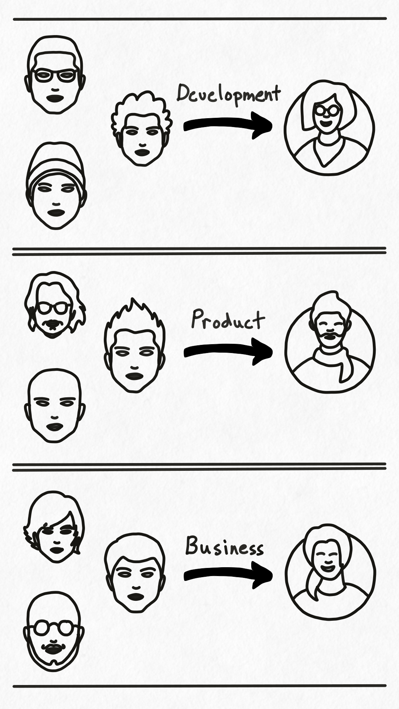
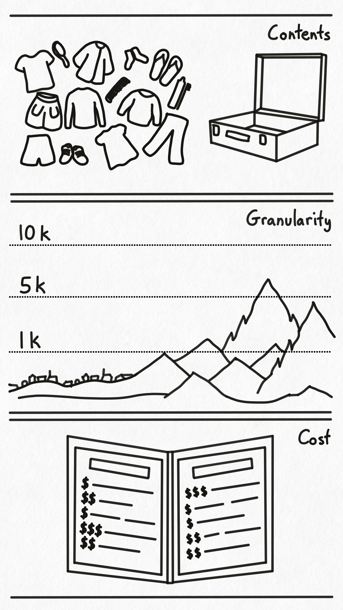

## Purpose of Documentation

In the process of developing software products we have many different people involved. Product owners, product managers, and designers; developers, engineers, and qa; team leads, program mangers, and stakeholders; all are working toward a set of goals. These goals are varied and often overlap. Some examples include drafting product designs and plans, designing user interfaces and flows, writing code and developing software, testing products and releasing them, and understanding what everyone is doing and who is responsible for what. And the common thing that enables each person to reach their goals is the knowledge of how to perform the process(es) that lead to their goals. 

This knowledge comes in many forms, such as having done it before, asking someone else how to do it, intuition, trial and error, reading through what others have done before, etc. But of all of the available options one of the quickest and most cost effective ways is reading a document describing the process of how to accomplish that goal. And the set of documents that contain the knowledge of how to accomplish those goals is called documentation. Stated another way, the **purpose of documentation is to help people achieve their goals**.

Also note that the purpose of documentation is not limited to just people anymore. With the general availability of large language models and specialized agents, the purpose of documentation has been expanded to help people __and AI__ achieve their goals.

## Persons to Personas

You might be tempted to just dive in at this point and start making documentation for everyone, but it usually is not practical to make a different set of documentation for each person. Instead we create a set of personas, which are a semi-abstract representation of the set of people in a group based on knowledge and experience with that group of people. Then, once we have these personas, or groups of individuals, we create documentation for them.

For example, software development teams are typically made up of many different types of developers and engineers that all play a part in building, maintaining, and debugging a system. Rather than create documentation specific to each individual engineer on each team, we usually want to create sets of documentation for each archetype of developer or engineer. This pattern also works for handling product and business documentation, where there are usually logical groupings of individuals (sometimes defined by roles) that can be treated as a conceptual group. And then once grouped you can create the documentation needed by the group itself.

Note that you should be cognizant of the issues that come when creating personas for groups of individuals where the knowledge or skill level varies a lot. For example, individuals with only a little knowledge or experience in the area being documented often require significantly more detail than individuals with much more knowledge or experience. In those cases it is wise to craft your personas so they are not too large, and it can often be helpful to document the minimum level of knowledge or experience for each persona.

Also note that the delivery mechanism for your documentation should ideally be local to or easily accessible by the people using it. Just saying.

## Grouping your Goals

Now that we've grouped our people into personas, we also need to group our goals into objectives at about the same level of granularity. This lets us consider common groups of goals when considering what documentation is needed for each persona.

For example, development teams need to write and code software, maintain that software and associated infrastructure, and debug it when things go wrong. All of these goals can be grouped under a larger goal, or objective, of developing systems. Likewise, product owners and user experience specialists have goals of researching and understanding customers, drafting up proposals and features, and designing user interfaces. Summed up these smaller goals could be conceptually grouped into a larger objective of building products. And finally, managers and stakeholders look at calendars, task lists, and completion projections to better run a team.

A benefit of grouping goals is that the format, layout, and structure of your documentation often materializes when you look at the higher-level objectives. That, combined with a documentation methodology like [Diátaxis](https://diataxis.fr/), can often be enough to answer the question of "where does this go".

## Deciding on Documentation

Now that we have Personas and Objectives, we need to decide on the set of documentation that should exist that allows said persona to complete their objective. To do this we need to take into account 3 main things: what should we include (and leave out), how granular or detailed should we be, and what are the costs associated with creating and maintaining each piece of documentation.

Deciding what to include and what to leave out of documentation is similar to deciding what to pack for a trip. You want to pack enough to be comfortable and have what you need without over packing, and what you pack will depend on where you are going, for how long, and what are you doing there.

Once you decide what to include (and exclude), you then need to decide how granular to be. For certain objectives you may be able to document at the 10,000 foot level because your team or organization is made up of seasoned professionals. Or you may need to document at a much higher level of granularity because of the risks associated with getting a certain procedure wrong when handling customer's money. Whatever level you choose, the act of considering your options here will pay dividends when you go to write and maintain your documentation.

Speaking of writing and maintaining, that process comes with a cost. Creating and maintaining documentation is never free, and the approach you take can drastically change both the initial and long-term costs. For example, if you choose to include screenshots of an application in your documentation, it may be a low-cost initial investment, but now you need to keep those screenshots updated as the application changes. If change is rare it might not be too bad, but if there are a lot of screenshots and the application changes frequently, the costs to keep everything up to date can quickly get out of hand.

## Writing with Purpose

Once you have your personas and objectives, and have decided on what documentation to write, you now need to author and maintain that documentation. When you do, remember that the purpose of documentation is to help people achieve their goals.

To write your documentation select the persona that it is for. This will be the audience for your document. Then chose the objective(s) that you want to help that persona achieve. This will show you the outcome you need to achieve. It may be helpful to write this down at the top of your document using a phrase similar to "The purpose of this document is to help `<persona(s)>` accomplish `<objective(s)>`".

Once you have your purpose you can then decide what to include, how granular to be, and how much cost you are willing to incur. These decisions will shape the actual contents of the document and guide you when authoring it. Just remember to consider both the cost of creating and the cost of maintaining :).

Once a draft of your document is complete it can be helpful to test it with one or more actual people associated with your persona. This helps to ensure that the document actually aids that person in achieving the goal(s) stated in the objective. Once tested you can finalize your document and send it out into the world.

Now go forth, and write your documentation!

