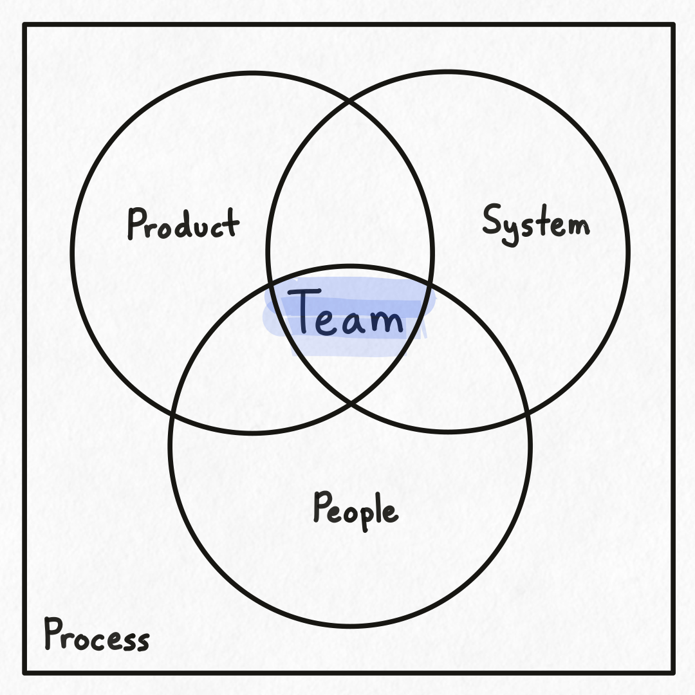
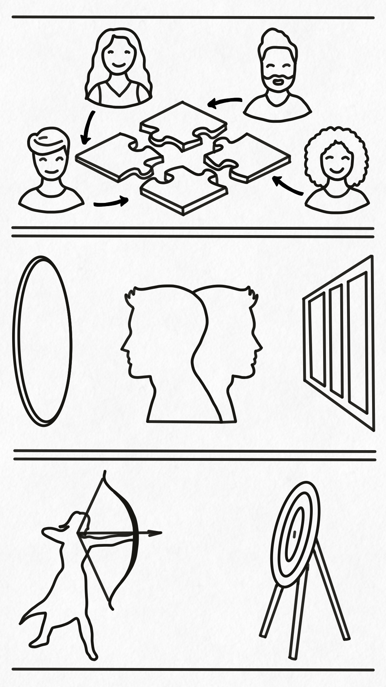
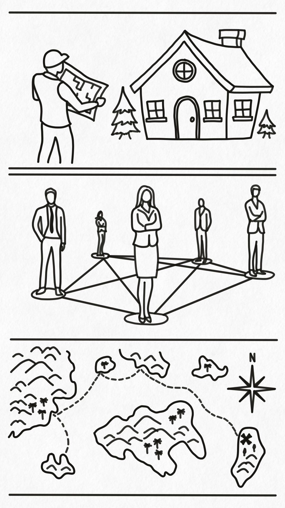
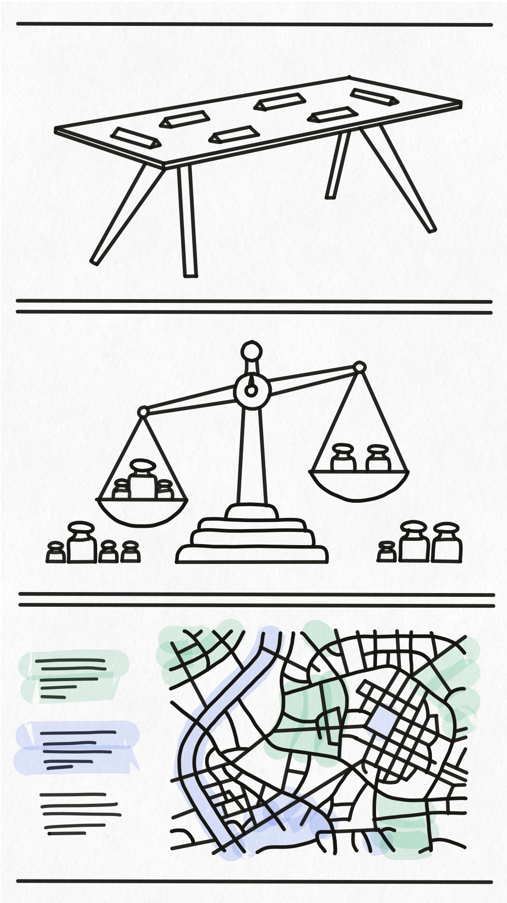
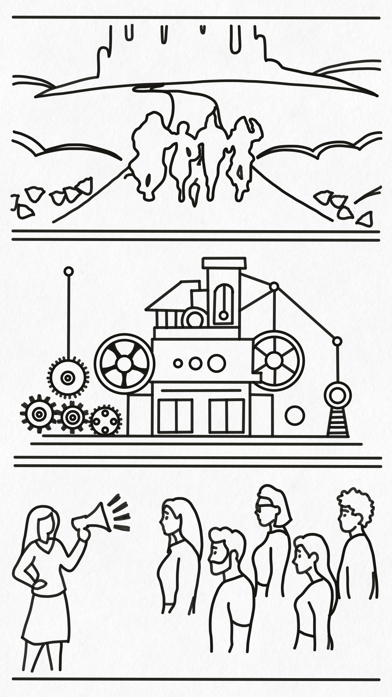

## Software Product Development Teams

The 4 conceptual components that make up a software product development team within an organization are people, products, systems, and processes. People are the individuals within the organization assigned to the team itself. Products are discrete sets of software features that are bundled together and delivered to end users. Systems are software components, either purchased or built in-house, that are used to deliver one or more products. And processes are sets of tasks that are completed to accomplish a goal within the team or organization.

A word about products and systems. While it is entirely possible to operate a team by treating everything as either a product or a system, there are a few benefits when you differentiate them. The first benefit is the delineation of skill sets typically found in people. The people who define and manage the features of a product (i.e. the set of things the end user can _do_ or _accomplish_ in a product) are usually different than the people who manage and build the features of a system (i.e. the set of things that _deliver_ or _support_ one or more product features). Said differently, those who focus on products have skill sets centered around determining what markets and end-users need and those who focus on systems have skill sets centered around building technical architecture and components to deliver what was determined to be needed. Sometimes these people are the same, and sometimes they are different.

The second benefit of differentiating between products and systems is that you need to be in a different head space when thinking about a product versus thinking about a system. A main concern when designing and managing a product is determining what to build that will solve or address a user's needs. You are thinking about pain points, benefits, sellability, flows, ease of use, and all sorts of considerations focused on the end user and their use of the product.

On the other hand, a main concern when building and managing a system is determining how to build and deliver the needed software. You are thinking about data flows, architecture, complexity costs, delivery, performance, reliability, and all sorts of considerations focused on the product and the delivery of that product. Note that there are overlaps between the two concerns, and a definite need to balance them. For example, when determining what to build you need to balance the set of desired features and capabilities against the costs and complexities of building and delivering software to support said features and capabilities. Both perspectives are required, but the head spaces and focuses for each are different.

It is also important to note that the relationships between products and systems overlap and that each is recursive in nature. A product typically contains multiple systems, and a system can support multiple products. For example:
- Netflix (a product) uses streaming systems, recommendation systems, a user management system, etc.
- The user management system within Stripe supports a variety of products such as Payments, Billing, Identity, etc.
- Microsoft 365 (a product) contains other products such as Word, Excel, PowerPoint, etc.
- Kubernetes (a system) is comprised of a control plane (system) and one or more worker nodes (system) that integrate and operate together.

The tldr is that a software product development team in an organization is defined as the intersection of a set of people, products, and systems supported by a set of processes.

## People

Every software product development team is comprised of at least on person, and usually consists of a group of people working together. Whomever is managing and running the team wants to be effective and efficient. The following are a few items every team leader needs to consider.

### People are unique
The people around you are heterogeneous, even if they don't look like it. And that is awesome! Everyone has their own unique perspective and skill set. Part of the job of an effective team leader is leaning into this uniqueness and putting your team together like a puzzle. Every piece is different, and based on the needs of the team there exists one or more optimal configurations of people and responsibilities that will allow you to deliver on your goals. You need to seek to understand the people you have and the skills you need, and _then_ put them together. Sometimes that means hiring for missing pieces, and other times it means throwing out the standard roles and hand-crafting an atypical team that works together just right. Lean into the differences, and you may be surprised at what your people can actually do.

### People need focus
Most people suck at multitasking, and the energy cost of constantly context switching is high. So when you are assigning people to teams don't "split" them between teams. When you do, you are doubling the number of processes, meetings, and relationships they need to maintain. You are putting them in a position where they will constantly need to switch contexts between team-level concerns as well as switching between individual-level concerns. This constant switching makes them less-effective overall and is a constant drain on them.

Also, because they are on more than one team, it can often be the case that they end up belonging to no team at all. This can happen when a person is unable to integrate with either team fully because they have double the process, meetings, and focus. These extra concerns can squeeze out the space needed to bond and make a person feel like an outsider because they aren't always there with the rest of the team.

So when you find yourself wanting to "split" a person, don't. Look at re-aligning the products and/or systems assigned to a team, or creating a 3rd team instead. It is almost always better to be able to join a team as a whole person instead of floating between teams as a half-person.

### People crave clarity
To quote a favorite movie "stay on target, stay on target". The number one trick to helping your people stay on target and focus on what is important is by telling them what is important. As silly as this sounds, it is uncommon to have organization and team leaders clearly communicate what is important and what is not. And just communicating the tasks or items that are important is not enough. You need to communicate the context and priorities that went into prioritizing the tasks and items. This context allows an individual to figure out for themselves if and when an item is important or not.

Often, when you don't communicate the information people need to determine what is most important themselves, you get frustrated. You see people go off and work on what you consider to be unimportant, actively ignoring the things that are important. When this happens ask yourself "have I communicated the necessary context, background, and overall priorities such that they can determine what is important? And if so, do they understand that context and do they have the autonomy to act"? Many times the answer to this question is no. And many times when you ask a person why they prioritized something the way the did you find out that there was a piece of context, background, or higher-level-prioritization that you didn't convey. And sometimes you also realize that you yourself didn't consciously realize there were some additional considerations that went into that decision, let alone communicated those considerations to them!

## Product

Most software product development teams are responsible for at least one product, even if they don't know it. A product is a set of features or capabilities that your end-users can use to accomplish their goals. The most obvious products are those that are bundled and sold to end users directly, like a public-facing SaaS product that you pay for with a credit card. But other times your product isn't quite as obvious.

For example, if your team is in charge of internal APIs that handle authentication and authorization, you might think that you have no product. You would be wrong, because other teams use your internal APIs to in their products and systems. Your product is actually the capability for other teams to call your APIs to authenticate and authorize actions within their products and systems. Your end-users just happen to be internal and are those other teams! So whether the end-users of your product(s) are internal or external, here are a few things to consider when managing the products your team is responsible for.

### Well defined
Knowing what a product is and isn't is critical. Just like a builder that follows an architects blueprints to build a house, you need to create a blueprint and decide what your product is and isn't. You need to be able to clearly articulate the problems your product needs to solve for your end-users. You need to be able to sharply define the boundaries of your product, what it is and is not and what it will and will not do. You need to be able to accurately describe the pain your users are experiencing and how your product will alleviate it. By defining your product you will help your team focus on building what your users actually need, and avoid building a high-rise in the middle of the forest.

Also, it should go without saying that you need to define your product durably. It is usually not enough to just talk about it. Write things down and reference them as you build and refine your product. And then continually challenge your definition and make sure it stays accurate as you learn more about what users need and what you can build. Then you will be able to use that definition to more effectively plan and communicate what your product is, does, and needs.

### Accessible users
Two truisms: a product is worth nothing without users, and you can't make a product without knowing your users. You need to know what they need, what they like, what they hate, etc. And the best way to learn about your users is to talk to them. Create a network of users and get to know them. Ask them questions and show them what you are thinking about. And this doesn't just go for the product person on the team. Get the whole team involved! The more your team knows and understands your users, the better your product will be.

Note that there is something special about seeing a product you built actually being used by someone. It can be a real moral booster, and in many cases someone on your team will see something or have an idea that will make your product even better. So as much as possible get your team in contact with actual users of your product so they can get to know them, and make figuring out their needs a team effort.

### Clear destination
Your product needs a clear destination. Just like the X on a treasure map, you and your team need to know where they are going. Every product has a set of goals that constitute success. Knowing what those goals are allows a team to properly prioritize features, focus on the market, and make the right calls on what to build and how to build it. You need to pick where you are headed and then make sure everyone on the ship knows where that destination is. The only way to sail the ship and reach the treasure is by working together as a team.

A note about the journey. Before GPS, sailors navigated to where they were going by tracking where they had been. They kept detailed logs of course, speed, and distance to where they were at any given point. Their current location, combined with an understanding of their destination, let them chart a clear course to get them there.

A product journey is very similar. You have a destination and a vision in mind, and you are working to get there. And when you are working with your team to chart a course to your destination, it really helps if everyone has a shared understanding of where you have been. Knowing about the journey add so much more context to the conversation. Understanding industry cycles, past struggles, failed experiments, and other events that have blown you off course in the past helps you understand what could happen in the future. In many cases you can have a more effective conversation about getting to your destination by considering both where you are now _and_ how you got there.

## System

One of the biggest focuses of a software product development team is developing software. The software a team develops, manages, and maintains is composed of software systems, or pieces of software that work together to deliver on or more software products. The delivery of a system can be direct (like a sign in form or the application itself) or indirect (like a support system or knowledge base). Either way, the purpose for any software system used by the organization is to deliver, directly or indirectly, the products being sold or provided by the organization. So as you go about defining, building, and maintaining your software systems, here are a few things to keep in mind.

### Ownership
Every piece of software used by an organization needs an owner, just like every guest sitting at a formal dining table needs a placard. It defines who is ultimately responsible for each piece of software and where that software sits in the organization.This ownership manifests differently in different organizations. Some common system owner titles are system steward, a council, a working group, team B, or individual X.

However it is defined, this single point of responsibility is critical for a few reasons. The first is that it provides a clear decision maker. If everyone knows who has the final call, you can reach decisions much faster and avoid having to revert changes that were made out of sight of the owner. The second is that it provides a clear point of coordination. In many cases there are pieces of software used by many different teams and coordinating the effort of enhancing or fixing a shared system is critical. The third is that it provides a clear point of contact. When something happens knowing who to go to is incredibly useful. Having an owner provides that clear point of contact so that questions, issues, and requests can be handled and routed appropriately.

A note about resourcing: ownership does not automatically mean that the owner is the only one who can perform work on the system. In many cases owners do not have the resources to make every change requested by other teams. In those instances the owner can coordinate and accept changes into the system that are authored by other teams. If this frequently happens it can be helpful to actively setup systems and resources to help other teams contribute so the owner can focus on facilitating said contributions.

### Prioritization
Knowing what to do when is one of the most critical pieces of information to know at any given time. Having the ability and knowledge of how to weigh priorities against each other allows you to work on the right thing at the right time. As a leader of a team your job is to pass along the context necessary for each individual to clearly understand which tasks and which systems receive the highest priority.

Every software system in a company is at a different point in its lifecycle. Some are just being designed and built, some are in maintenance, some are approaching end of life, and some are being actively sunsetted and decommissioned. They all have a relative priority and importance to each other and to the company. Knowing that priority allows teams to make good decisions about what to focus on and what to do to each system.

### Boundary
Every system needs a clear and well defined purpose and scope. This information is what allows teams to self-manage the design, build, and maintenance of a system within the organization. Without a clear purpose and scope the boundaries between systems become muddy and you risk chaos and confusion about where to put functionality and who owns what piece.

Ideally you have a system catalog in a hierarchical format that lets you clearly articulate what systems exist, what their purpose is, what they do and don't do, where they live, etc. This list is useful as it allows teams to discover and coordinate without a strict top-down or centralized coordination effort. There is absolutely a place for governance and control, but with well defined purpose, scope, and boundaries on each system that coordination and governance is much easier to maintain.

## Process

Every activity performed within a company maps to a process, even if that process is only implicit and undocumented. From the smallest change to a running system to the design and launch of a new product, every action is a part of a process.

Being deliberate and defining your processes is critical to your success as a software product development team. Note that being deliberate does not mean being rigid, and defining process does not mean being pedantic. It simply means as you go about building products, writing software, and managing people that you are conscious of the processes you are engaged in and seek to make the implicit explicit. As you do that here are a few things to consider.

### Well Defined
Having straightforward and well defined processes are critical to getting people to follow them. The process of follow the yellow brick road is straightforward and well defined. It is well defined because you literally walk on the road until you reach Oz. It is also straightforward, or easy to understand. Note that straightforward is not the same as simple. In the story Dorothy came across many challenges and complications on her way to Oz, but the directions for getting there were extremely uncomplicated. In your organization there will be many processes that need to be defined and carried out. If you focus on making them well defined and straightforward, you will have a higher degree of understanding and compliance towards your processes.

A note about implicit processes. There are many things that you believe should be done, and are so obvious that anyone should be able to "just know" what, when, or how to do it. That may be the case for someone with your skills and background, but just remember that people are unique and have different perspectives. Always lean toward defining and communicating explicit processes rather than rely on implicit processes that aren't clearly defined or communicated.

### Automatic
To get something to be a habit it needs to happen nearly automatically. Forming habits in people is hard and takes time. Forming habits in software is easier, as a machine will do the same thing every time. Because of that always be working on making processes automatic wherever possible. If a process can be automated, automate it. The series of 7 steps that need to be done in a very specific order before pushing out a product update? Automate it. The process of testing and vetting a software release before it goes out? Automate it. Need to gather feedback for and from teammates for your annual review? Automate it :). Machines are better than humans at doing the same thing every time, so leverage that in your team as much as possible. And for things that require people, training and deliberate practice can help make following process more automatic.

A note about intent. It is a lot easier to follow a process if you understand what the intent, or the reason for and desired results of a process, is. Many times a process will be rolled out without the corresponding information of _why_ that process exists in the first place. This can cause frustration and friction as people naturally push back against the change. Taking the time to explain and ensure the intent or _why_ of the process can do wonders in helping people follow and even champion said process.

### Communicated
If you don't tell someone they need to do something, don't be surprised when they don't. Process needs to be communicated, loudly and clearly. When you onboard someone to the organization you typically have them trained to do their job and communicate the processes needed to do that job. The truth about process is that training and communication can't stop after the first few days or weeks. It is a continual process unto itself, and never ending.

When you are communicating it can sometimes feel that you are saying the same thing over and over again. A small secret is that if you don't feel that you are over communicating, you are probably under communicating. Just make sure to vary the means of your communication and use a mix of words, documents, and pictures whenever possible. Make checklists and templates. Put up signs and reminders. Talk about and reference things often. Make communication a part of who you are.

A note about information locality. Whenever possible ensure that the process documentation is as close as possible to when and where the process takes place. If it is not visible or easy to reference it probably won't be. And if the process documentation can be integrated into the process itself, do it. Documentation that is easy to reference when you need it is documentation that has a much higher chance of being referenced. So when your team's process documentation sits on an internal SharePoint site and the entire team uses Confluence, don't be surprised when the team doesn't know about or reference the documentation.

## In Conclusion
Being intentional about managing the four components of a software product development team can help you be a more effective leader. Remember that people are unique, need focus, and crave clarity. Make sure your products are well defined, that you have ready access to your users, and that you provide a clear destination. Ensure your systems have clear owners, are properly prioritized, and have well defined purposes and scopes. And keep in mind that processes need to be well defined, made as automatic as possible, and communicated loudly and clearly. You can do it.