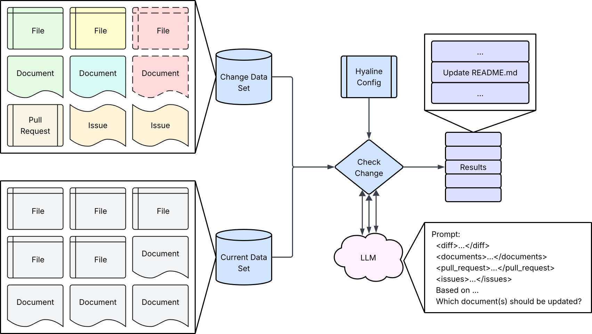

# Overview
Hyaline has the ability to check the current set of documentation against a changed set of code and documentation to determine which pieces of documentation (if any) need to be updated. The goal is to identify each piece of documentation that could be affected and present that list to the human making the change. Hyaline also has the ability to call out to an LLM to generate a suggested change to each piece of documentation if desired.

In the diagram above you can see that we have 2 data sets, a change data set and a current data set. The change data set has changed files, documents, and other change metadata like the pull request and related issues. It was extracted using [Extract Change](./check-change.md) The current data set has the current set of files and documents for the system, and was extracted using [Extract Current](./extract-current.md). Check Change uses both data sets, the [Hyaline Config](../reference/config.md), and multiple calls to an LLM to determine the resulting set of system documentation (documents and/or sections) that may need to be updated as a result of the change.

Note that if the system spans repositories or includes documentation from documentation sites, you can use [Merge](./merge.md) to merge a fresh current extract for the repository files and documents with a previously extracted data set that contains the rest of the system documentation.

For more information please reference the following documents:

* [Extract Change](./check-change.md)
* [Extract Current](./extract-current.md)
* [Results](../reference/results.md)

# Recommendations
Hyaline loops through each code change and conceptually examines the links between the code and documentation and asks an LLM "based on this change and the associated metadata, what documentation should be updated and why?". Hyaline then compiles the set of documentation (documents and sections) that needs to be updated into a unified list of recommendations and presents those results to the human(s) that made the change.

## Directly via updateIf
Hyaline's configuration has the ability to express direct relationships between documentation and code via a set of updateIf statements. These statements direct Hyaline to mark documentation as needing an update if any code matching a glob is updated in a certain way in the change. For example:

In this example we have a Change Data Set that has a modification to the file `package.json`. In our configuration we have an updateIf statement that tells us that we may need to update `README.md` if `package.json` is modified. Based on that information Hyaline adds a entry to update the `README.md` file to the results.

Note that updateIf supports the following changes:

* `touched` - If any files matching the glob were touched in any way (Created, Modified, Deleted, or Renamed) as a part of the change
* `added` - If any files matching the glob were added in the change
* `modified` - If any files matching the glob were modified in the change
* `deleted` - If any files matching the glob were deleted in the change
* `renamed` - If any files matching the glob were renamed in the change

Also note that the configuration supports targeting a specific code source vs looking for any change across all available code sources.

For more information please visit the [configuration reference](../reference/config.md).

## Indirectly via LLM
Hyaline will call out to an LLM to determine which documentation (if any) should be updated for each specific change. To do that Hyaline formats the following information and includes it as context in the LLM call:

* The diff of the changed file
* A list of system documentation (including each document and section's purpose)
* The pull request (if available)
* The list of related issues (if available)

The LLM then responds with an indication of the set of documents and/or sections that should be updated or with an indication that no updates are needed based on the supplied information. For example:

In this example we have a Change Data Set that has several file modifications. Hyaline takes those changes and calculates diffs, and then for each diff calls the llm and asks which documents and/or sections need to be updated based on that change. The context to the llm includes the change metadata mentioned above if it is available. If the LLM responds with a set of documents and/or sections that need to be updated Hyaline adds entries for each document/section to the results along with the reason for the recommendation.

## Compilation of results

The resulting entries from both the updateIfs and LLM calls are combined and compiled into a single list of documents and sections needing to be looked at. If a document or section was identified as needing to be updated for more than one reason, a list of reasons for that update are returned. There will always be at least one reason for each entry in the list of results.

# Suggestions

If configured to do so, Hyaline will take the list of recommendation results and ask an LLM what updates should be made to each document or section. To do that Hyaline formats the following information and includes it as context in the LLM call:

* The set of diffs that were identified by the LLM as relating to this update
* The pull request (if available)
* The list of related issues (if available)
* The contents of the document or section that needs to be updated.

The LLM responds with the suggested update to the document or section, and that suggestion is then added to the list of recommendation results that are returned.

# Next Steps
You can continue on to see how Hyaline can [generate a configuration](./generate-config.md) or [merge data sets](./merge.md), or see how Hyaline extracts [current](./extract-current.md) or [change](./extract-change.md) data sets.
