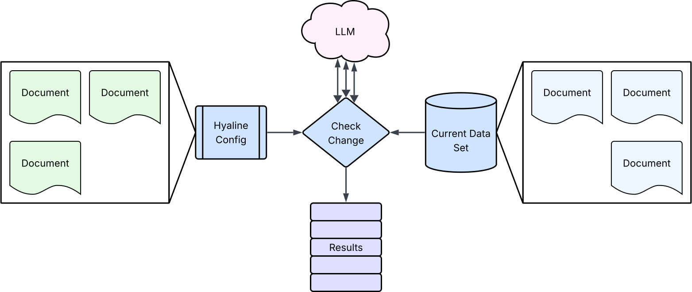
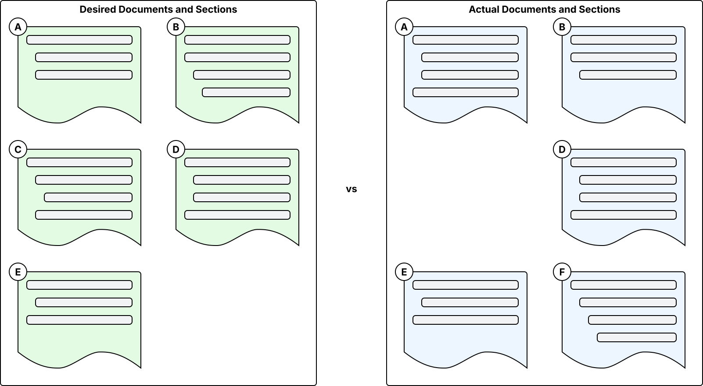
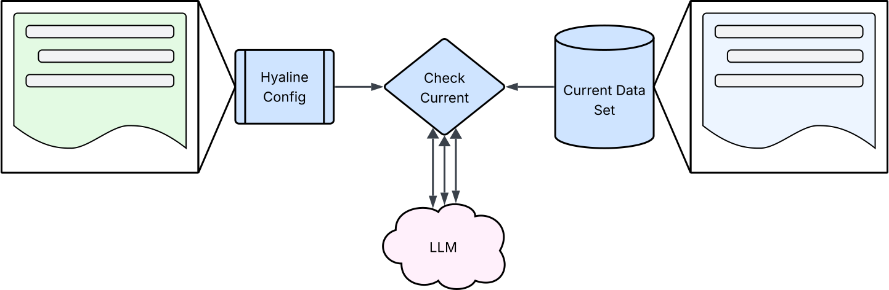
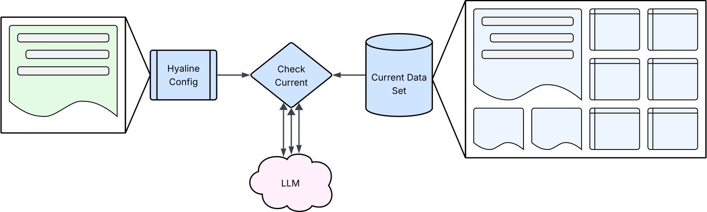

# Overview
Hyaline has the ability to check the current set of documentation against the configuration and look for issues that should be addressed. The goal is to verify that each piece of documentation (each document/section) that is extant is present in the configuration with a purpose, and that each document or section present in the configuration exists, matches its purpose, and is complete.

TODO explanation of image

TODO link to Extract Current and output results reference page

There are 4 primary checks that Hyaline can perform on current documentation:
* Check that the desired documents and sections exists in the configuration
* Check that documents and sections marked as required in the configuration actually exist
* Check that documents and sections match the purpose stated in the configuration
* Check that documents are complete based on its stated purpose

# Check Desired Document Exists
This check, identified by `DESIRED_DOCUMENT_EXISTS`, is intended to help identify those documents and/or sections that are present in the actual extracted documentation but are not present in the configuration.

TODO explanation of image

Note that Hyaline supports both the scenario of creating documentation before the configuration as well as the scenario of creating the desired documentation in the configuration before it actually exists. This means that you can react to new documentation as well as declare desired documentation beforehand and Hyaline will support both scenarios.

This check will have one of the following results:
* `PASS` If the extracted document or section exists in the configuration for the documentation source.
* `ERROR` If the extracted document or section does _not_ exist in the configuration for the documentation source.

# Check Required
This check, identified by `REQUIRED`, is intended to identify those documents and/or sections that are marked as required in the configuration but do not exist in the extracted documentation.

TODO explanation of image

This check is particularly helpful for scenarios where a centralized authority decides that certain documentation needs to exist. In that case they can create the configuration for the documentation, stating it's purpose, and then mark it as required. Hyaline will pick that up and check for it when checking current documentation, and will also use that information when determining what documentation should be updated when checking changes.

This check will have one of the following results:
* `PASS` If the configuration indicates that this document or section is required and it exists in the extracted documentation.
* `ERROR` If the configuration indicates that this document or section is required and it does _not_ exist in the extracted documentation.
* `SKIPPED` If the configuration indicates that this document or section should be ignored.

# Check Purpose
This check, identified by `MATCHES_PURPOSE`, is intended to identify those documents and/or sections that do not match the purpose of that document or section as defined in the configuration.

TODO explanation of image

This check is helpful in determining if documents or sections actually accomplish their stated goal(s) (or purpose). 

This check will have one of the following results:
* `PASS` If the extracted document or section is determined to match the purpose declared in the configuration.
* `ERROR` If the extracted document or section is determined to _not_ match the purpose declared in the configuration.
* `SKIPPED` If the configuration indicates that this document or section should be ignored.
* `WARN` If the document or section does not have a purpose stated in the configuration.

# Check Completeness
This check, identified by `COMPLETE`, is intended to identify those documents that are incomplete as defined by the purpose of that document or section in the configuration.

TODO explanation of image

This check is helpful in determining which documents and/or sections are not as complete as they could be as defined by their purpose as stated in the configuration.

This check will have one of the following results:
* `PASS` If the extracted document or section is determined to be complete based on the purpose declared in the configuration.
* `ERROR` If the extracted document or section is determined to be _incomplete_ based on the purpose declared in the configuration.
* `SKIPPED` If the configuration indicates that this document or section should be ignored.
* `WARN` If the document or section does not have a purpose stated in the configuration.

# Next Steps
You can continue on to see how [check change](./check-change.md) works, or you can or see how Hyaline can [generate a configuration](./generate-config.md) and (optionally) purposes for previously extracted documentation.
