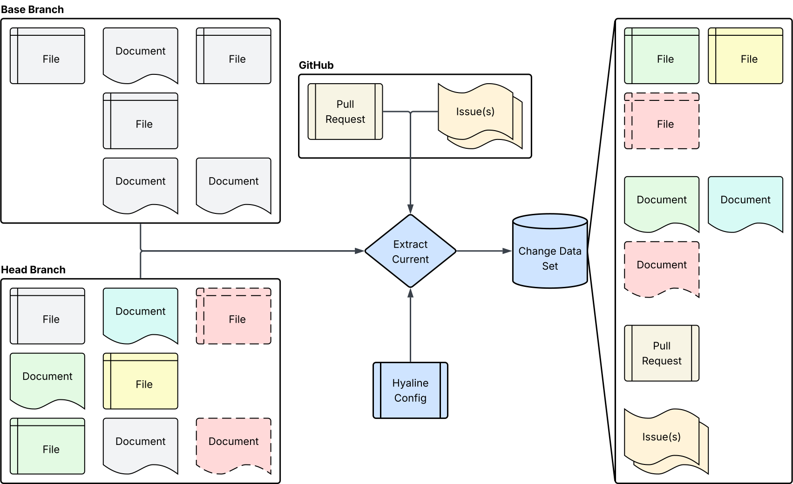
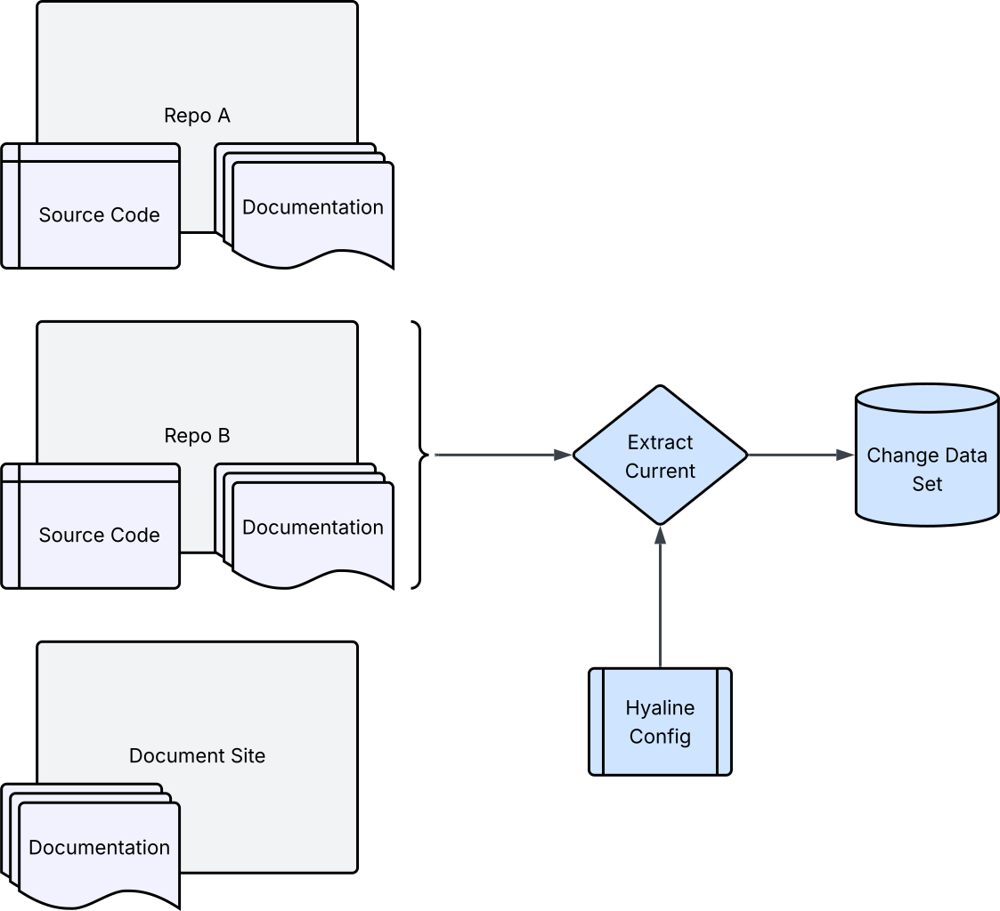
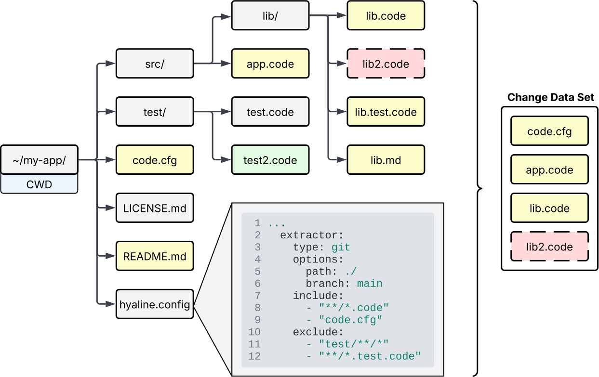
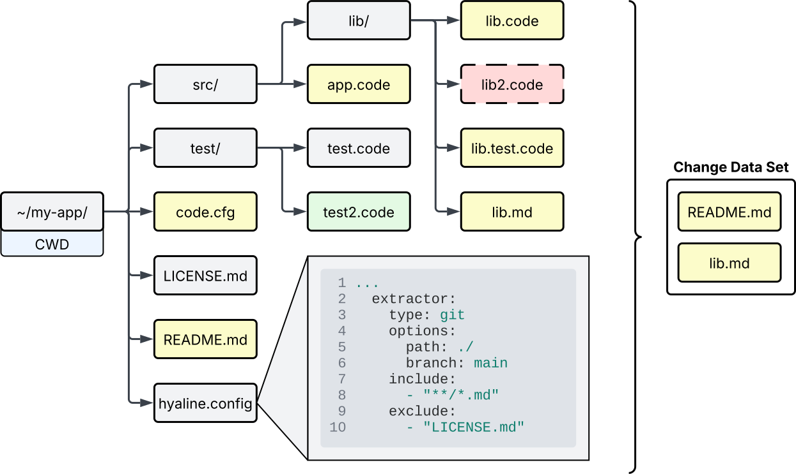
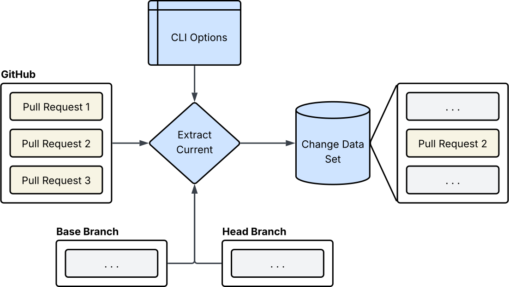
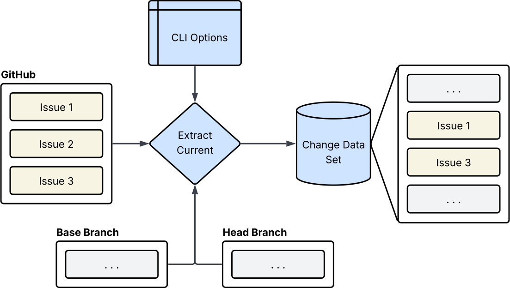

# Overview
Hyaline has the ability to extract the set of changed code and documentation, along with other change metadata, into a change data set that can be used to check for needed documentation updates based on the changes made. The goal is to extract only what code and/or documentation actually changed, alongside any relevant change metadata, into a discrete change data set.

In the image above you can see a simplified representation of files and documents in two branches of a repository, the Base Branch (usually main) and the Head Branch (usually a feature branch). You will also notice that there are several differences between the branches represented by different colors (new, deleted, changed, and renamed files and documents). Hyaline takes the diff between the two branches and extracts files and documents that have changed and place them in a change data set. Note that the code and documentation source configuration is used, so only files and documents that match the configured extractor includes/excludes are extracted.

Along with the files and documents, hyaline can also extract the pull request and issues associated with the change. The contents of these are also placed in the change set.

When extracting a change for a system you may have situations where a system is made up of code and/or documentation sources that come from more than one repository. In that case you can tell Hyaline to only extract a subset of the available code and/or documentation sources for the change, targeting a single repository at a time.

# Extracting Changed Code
System source code that changed is extracted for each targeted code source in the system. Note that the code source must be configured to use the `git` extractor for change extraction to work, as Hyaline compares two branches to extract the diffs used when extracting the change.

The extraction process uses the same configuration as the extract current process does, so if you haven't read up on how [extract current](./extract-current.md) works it would be helpful to do so now.

In this scenario we are extracting changed source code from a git repository located on the local file system at `~/my-app`, which is also the current working directory (CWD). The hyaline configuration file specifies that the path of this repository is `./`, and that we should include any files matching `**/*.code` and `code.cfg` while excluding any files matching `test/**/*` and `**/*.test.code`. Said another way, Hyaline will extract changed files that match at least one include glob and do not match any exclude globs. Hyaline loops through the diffs between `main` and `my-feat` (represented by color here) and extracts the following files:

* `~/my-app/code.cfg` - This is extracted because it matches the include `code.cfg`, does not match an exclude statement, and was changed.
* `~/my-app/src/app.code` - This is extracted because it matches the include `**/*.code`, does not match an exclude statement, and was changed.
* `~/my-app/src/lib/lib.code` - This is extracted because it matches the include `**/*.code`, does not match an exclude statement, and was changed.
* `~/my-app/src/lib/lib2.code` - This is extracted because it matches the include `**/*.code`, does not match an exclude statement, and was changed.

The following files are _not_ extracted:
* `~/my-app/test/test2.code` - This is not extracted because it matches the exclude `test/**/*` (even though it matches the include `**/*.code` and was changed).
* `~/my-app/src/lib/lib.test.code` - This is not extracted because it matches the exclude `**/*.test.code` (even though it matches the include `**/*.code` and was changed).
* All other files as they do not match an include glob or were unchanged.

**Note**: Hyaline uses [doublestar](https://pkg.go.dev/github.com/bmatcuk/doublestar/v4) to match paths relative to the root of the repository.

For more details on git extractor options please see the [configuration reference](../reference/config.md).

For more details on the schema of the change data set please see the [data set reference](../reference/data-set.md).

# Extracting Changed Documentation
System documentation that changed is extracted for each targeted documentation source in the system. Note that the documentation source must be configured to use the `git` extractor for change extraction to work, as Hyaline compares two branches to extract the diffs used when extracting the change.

The extraction process uses the same configuration as the extract current process does, so if you haven't read up on how [extract current](./extract-current.md) works it would be helpful to do so now.

TODO explanation of the image

TODO link to data set documentation

# Extracting Metadata
Hyaline also supports extracting additional metadata and context about the change, such as any pull request or issue information available.

## Pull Request
Hyaline supports extracting the title and contents of a GitHub pull request and the inclusion of that information in the change data set.

TODO explanation of the image above.

## Issues
Hyaline supports extracting the title and contents of one or more issues and that inclusion of that information in the change data set.

TODO explanation of the image above.

# Next Steps
You can continue on to see how Hyaline checks [current](./check-current.md) or [change](./check-change.md) data sets.