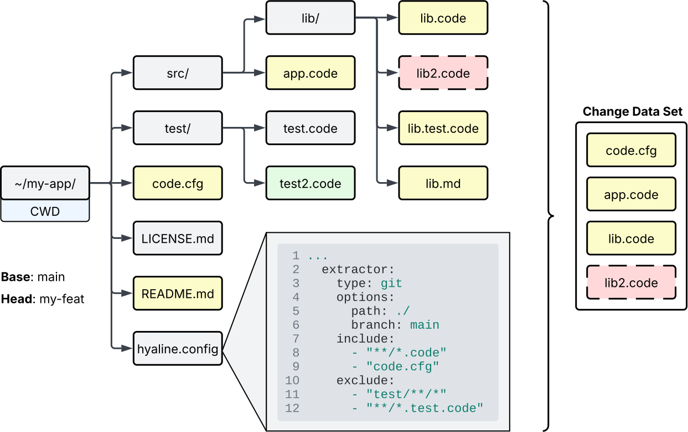
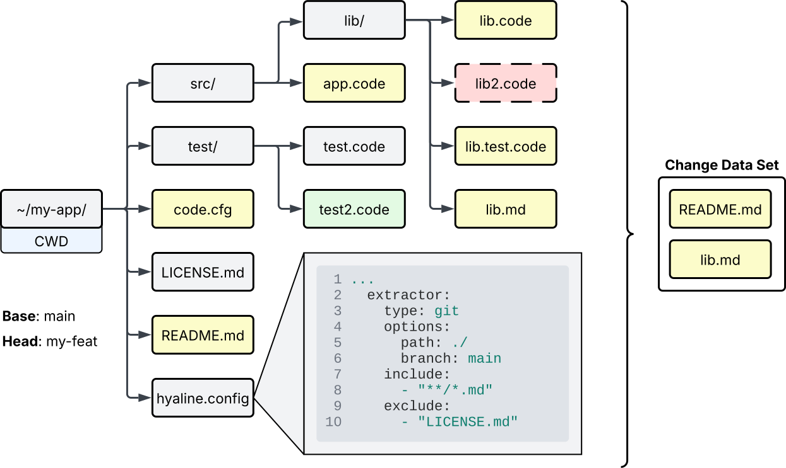

# Overview
Hyaline has the ability to extract the set of changed code and documentation, along with other change metadata, into a change data set that can be used to check for needed documentation updates based on the changes made.

TODO description of image above

TODO talk about when extracting change(s), how to target a single system, or even target just a single or the small set of code/documentation sources that actually changed. The goal is to extract only what changed into an addressable unit with all applicable data and metadata about the change.

# Extracting Changed Code
System source code that changed is extracted for each targeted code source in the system. Note that the code source must be configured to use the `git` extractor for change extraction to work, as Hyaline compares two branches to extract the diffs used when extracting the change.

The extraction process uses the same configuration as the extract current process does, so if you haven't read up on how [extract current](./extract-current.md) works it would be helpful to do so now.

TODO explanation of the image

TODO link to data set documentation

# Extracting Changed Documentation
System documentation that changed is extracted for each targeted documentation source in the system. Note that the documentation source must be configured to use the `git` extractor for change extraction to work, as Hyaline compares two branches to extract the diffs used when extracting the change.

The extraction process uses the same configuration as the extract current process does, so if you haven't read up on how [extract current](./extract-current.md) works it would be helpful to do so now.

TODO explanation of the image

TODO link to data set documentation

# Extracting Metadata
Hyaline also supports extracting additional metadata and context about the change, such as any pull request or issue information available.

## Pull Request
Hyaline supports extracting the title and contents of a GitHub pull request and the inclusion of that information in the change data set.

TODO explanation of the image above.

## Issues
Hyaline supports extracting the title and contents of one or more issues and that inclusion of that information in the change data set.

TODO explanation of the image above.

# Next Steps
You can continue on to see how Hyaline checks [current](./check-current.md) or [change](./check-change.md) data sets.