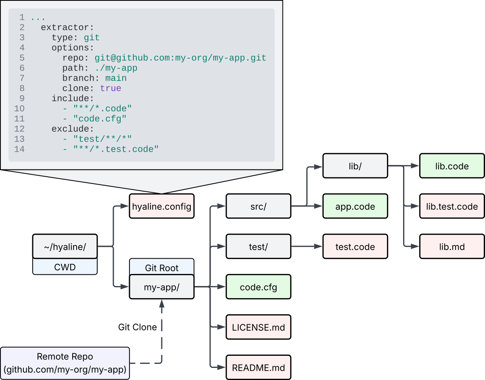
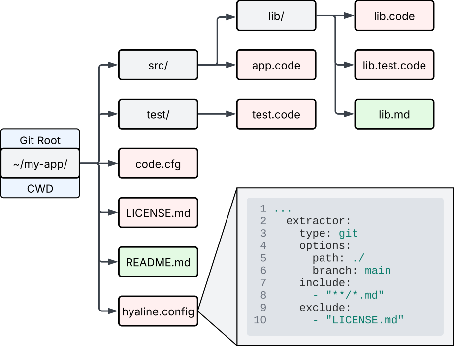
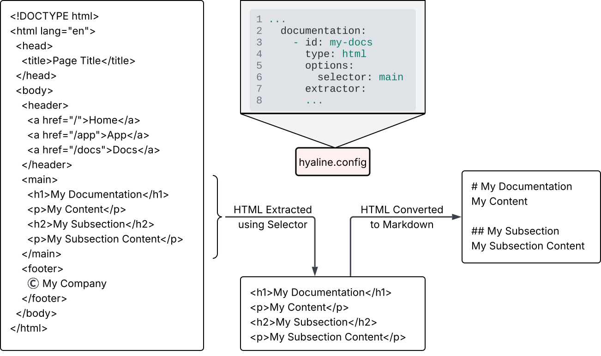

# Overview
Hyaline has the ability to extract code and documentation into a current data set that can be used to build systems and products as well as verify that existing documentation is accurate and complete.

In the example above you can see a variety of code and documentation spread over multiple repositories and documentation sites. Hyaline's extraction process can take all of this code and documentation and place it into a single, unified data set organized by system. This data set can then be used to [run checks](./check-current.md) and support building/maintaining products and systems via an [mcp server](./mcp.md).

The main unit of organization within Hyaline is the system. A system can contain any number of code and/or documentation sources. When using Hyaline, it is helpful to create multiple focused, single purpose systems rather than a single system with everything in it. Also note that there is no restriction on where the code and/or documentation of a system comes from, meaning that you can break up a mono-repo into multiple, smaller systems or piece together a system from code and documentation spread across a large number of repositories and sites.

# Extracting Code
System source code is extracted for each defined code source in the configuration (TODO link to config). Code can be extracted using one of two available extractors: `fs` and `git`.

TODO talk about what to extract (source code, not tests and other items)

The code that is extracted is placed into a data set that is stored in sqlite. TODO link to reference

## Extracting Code - fs
The `fs` extractor extracts source code from the local file system.

TODO explanation of image

## Extracting Code - git
The `git` extractor extracts source code from a local or remote git repository. It supports several different setups that are detailed below.

Note that Hyaline extracts code from a specific branch as specified in the configuration. It does this extraction via the git metadata itself, rather than requiring the repository to be in a specific state. In other words, you don't need to check out the main branch to extract code from it. Hyaline will use the internal git structure to scan and extract the code. 

### Local Repo

In this scenario a local repository already exists on the local file system, and Hyaline uses that repository to extract the code.

### Remote Repo, Cloned Locally

In this scenario Hyaline clones a remote repository down to the local file system, and then uses that local repo to extract code from. 

### Remote Repo, Cloned In Memory

In this scenario Hyaline clones a remote repository into a local in-memory filesystem, and then uses that in-memory repository to extract code from.

# Extracting Documentation
System documentation is extracted for each defined documentation source in the configuration (TODO link to config). Documentation can be extracted using one of three available extractors: `fs`, `git`, and `http`.

TODO discuss non-markdown to markdown conversion and selector for html sources

TODO talk about what to extract (documentation, can ignore items as needed)

TODO explain image

TODO talk about how sections are extracted.

The documentation that is extracted is placed into a data set that is stored in sqlite. TODO link to reference

## Extracting Documentation - fs
The `fs` extractor extracts documentation from the local file system. It operates the same way as the Code `fs` extractor (See Extracting Code - fs).

## Extracting Documentation - git
The `git` extractor extracts documentation from a local or remote git repository. It operates the same way as the Code `git` extractor and supports the same set of setups (See Extracting Code - git).

## Extracting Documentation - http
The `http` extractor extracts documentation from an http(s) server via crawling.

TODO explanation of image

TODO explanation of image

# Extracting Metadata
Hyaline will be extended to extract additional organizational metadata in the future. As of now, Hyaline only supports extracting pull request and issue information when extracting changes (TODO link to extract-change)

# Next Steps
You can continue on to see how [Hyaline extracts change information](./extract-change.md), or see how Hyaline can [merge together data sets](./merge.md).