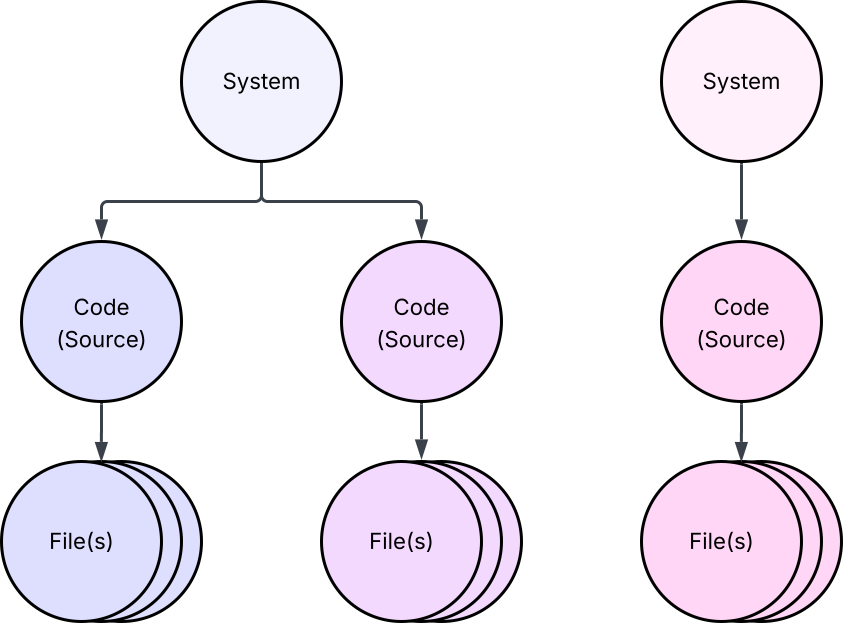
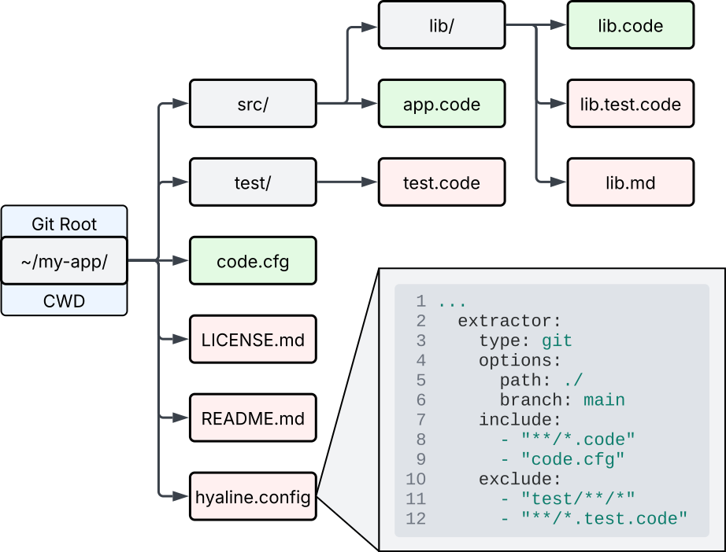
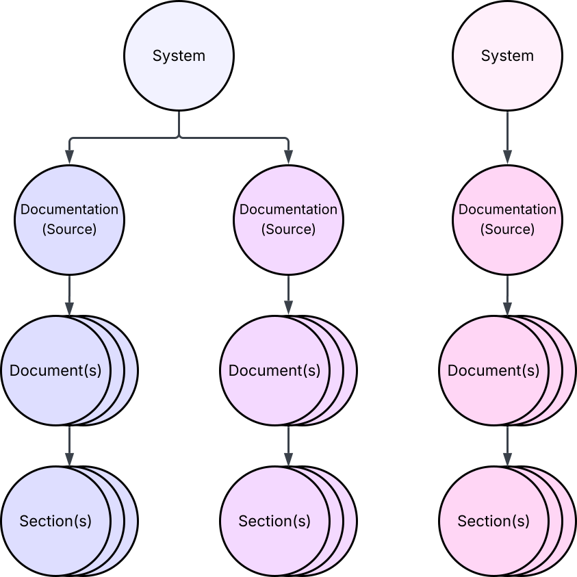
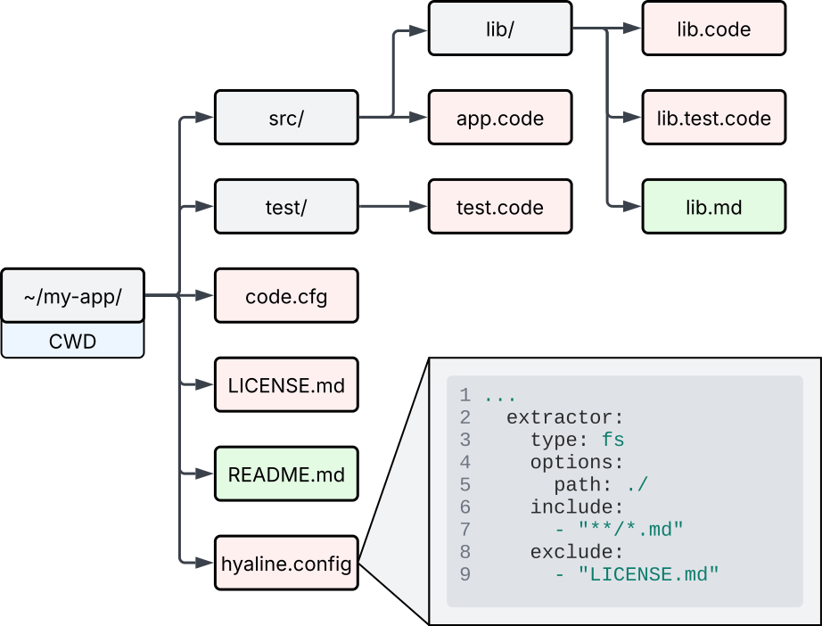
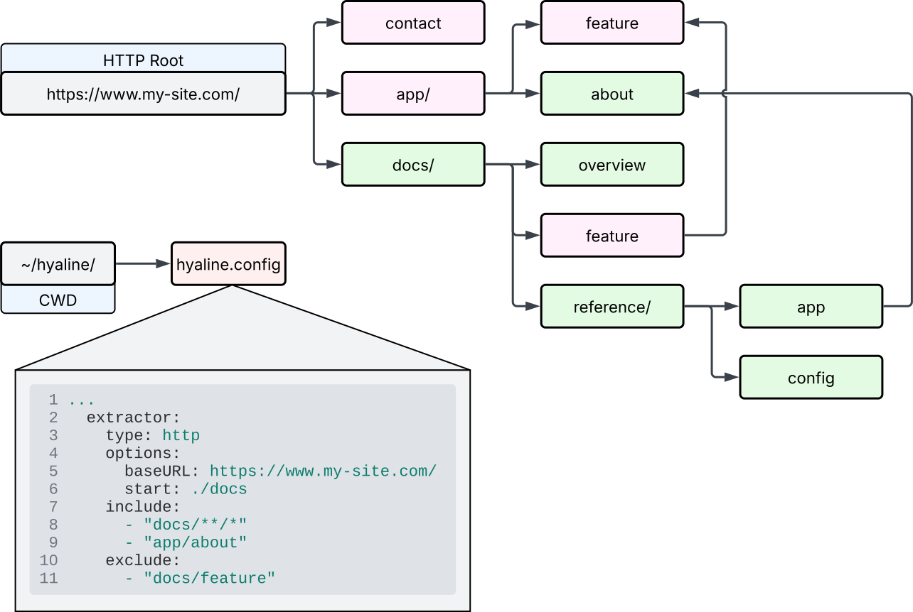

# Overview
Hyaline has the ability to extract code and documentation into a current data set that can be used to build systems and products as well as verify that existing documentation is accurate and complete.

In the example above you can see a variety of code and documentation spread over multiple repositories and documentation sites. Hyaline's extraction process can take all of this code and documentation and place it into a single, unified data set organized by system. This data set can then be used to [run checks](./check-current.md) and support building/maintaining products and systems via an [mcp server](./mcp.md).

The main unit of organization within Hyaline is the system. A system can contain any number of code and/or documentation sources. When using Hyaline, it is helpful to create multiple focused, single purpose systems rather than a single system with everything in it. Also note that there is no restriction on where the code and/or documentation of a system comes from, meaning that you can break up a mono-repo into multiple, smaller systems or piece together a system from code and documentation spread across a large number of repositories and sites.

# Extracting Code
System source code is extracted for each defined code source in the [configuration](../reference/config.md). Code can be extracted using one of two available extractors: `fs` and `git`.

Note that you usually only want to extract the source code and configuration, and not tests and/or other miscellaneous files. This is because Hyaline is focused on using and updating documentation, which does not _usually_ rely on and is not _usually_ impacted by tests.

The code that is extracted is organized into systems and stored as files associated with a code source. You can have any number of files associated with a code source, and any number of code sources associated with a system. For example, you could have frontend source code separated from backend source code separate4d from infrastructure code.

The code that is extracted is placed into a data set that is stored in sqlite. Please see the [data set reference](../reference/data-set.md) for more information.

## Extracting Code - fs
The `fs` extractor extracts source code from the local file system.

In this example we are extracting source code from the local file system directory `~/my-app`, which is also the current working directory (CWD). The hyaline configuration file specifies that the path of the source code is `./`, and that we should include any files matching `**/*.code` and `code.cfg` while excluding any files matching `test/**/*` and `**/*.test.code`. Said another way, Hyaline will extract files that match at least one include glob and do not match any exclude globs. Hyaline crawls the directory structure starting at `~/my-app/ + ./` and extracts the following files:

* `~/my-app/code.cfg` - This is extracted because it matches the include `code.cfg` and does not match an exclude statement.
* `~/my-app/src/app.code` - This is extracted because it matches the include `**/*.code` and does not match an exclude statement.
* `~/my-app/src/lib/lib.code` - This is extracted because it matches the include `**/*.code` and does not match an exclude statement.

The following files are _not_ extracted:
* `~/my-app/test/test.code` - This is not extracted because it matches the exclude `test/**/*` (even though it matches the include `**/*.code`).
* `~/my-app/src/lib/lib.test.code` - This is not extracted because it matches the exclude `**/*.test.code` (even though it matches the include `**/*.code`).
* All other files as they do not match an include glob.

**Note**: The fs extractor uses [Root](https://pkg.go.dev/os@go1.24.1#Root) when scanning a directory, meaning that while symlinks are followed they must be within Root (the `path`) to be included.

**Note**: Hyaline uses [doublestar](https://pkg.go.dev/github.com/bmatcuk/doublestar/v4) to match paths relative to the `path`.

For more detail on fs extractor options please see the [configuration reference](../reference/config.md).

## Extracting Code - git
The `git` extractor extracts source code from a local or remote git repository. It supports several different setups that are detailed below.

Note that Hyaline extracts code from a specific branch as specified in the configuration. It does this extraction via the git metadata itself, rather than requiring the repository to be in a specific state. In other words, you don't need to check out the main branch to extract code from it. Hyaline will use the internal git structure to scan and extract the code. 

For more detail on git extractor options please see the [configuration reference](../reference/config.md).

### Local Repo

In this scenario we are extracting source code from a git repository located on the local file system at `~/my-app`, which is also the current working directory (CWD). The hyaline configuration file specifies that the path of this repository is `./`, and that we should include any files matching `**/*.code` and `code.cfg` while excluding any files matching `test/**/*` and `**/*.test.code`. Said another way, Hyaline will extract files that match at least one include glob and do not match any exclude globs. Hyaline crawls the git repository structure starting at it's root and extracts the following files:

* `~/my-app/code.cfg` - This is extracted because it matches the include `code.cfg` and does not match an exclude statement.
* `~/my-app/src/app.code` - This is extracted because it matches the include `**/*.code` and does not match an exclude statement.
* `~/my-app/src/lib/lib.code` - This is extracted because it matches the include `**/*.code` and does not match an exclude statement.

The following files are _not_ extracted:
* `~/my-app/test/test.code` - This is not extracted because it matches the exclude `test/**/*` (even though it matches the include `**/*.code`).
* `~/my-app/src/lib/lib.test.code` - This is not extracted because it matches the exclude `**/*.test.code` (even though it matches the include `**/*.code`).
* All other files as they do not match an include glob.

**Note**: Hyaline uses [doublestar](https://pkg.go.dev/github.com/bmatcuk/doublestar/v4) to match paths relative to the root of the repository.

For more detail on git extractor options please see the [configuration reference](../reference/config.md).

### Remote Repo, Cloned Locally

In this scenario we are extracting source code from the remote git repository `github.com/my-org/my-app` and running Hyaline from the current working directory (CWD) `~/hyaline/`. Based on the configuration Hyaline will clone the repo into the path `~/hyaline/ + ./my-app` (CWD joined with `path`) and extract code from the repository. The hyaline configuration file specifies that we should include any files matching `**/*.code` and `code.cfg` while excluding any files matching `test/**/*` and `**/*.test.code`. Said another way, Hyaline will extract files that match at least one include glob and do not match any exclude globs. Hyaline crawls the git repository structure starting at it's root and extracts the following files:

* `~/my-app/code.cfg` - This is extracted because it matches the include `code.cfg` and does not match an exclude statement.
* `~/my-app/src/app.code` - This is extracted because it matches the include `**/*.code` and does not match an exclude statement.
* `~/my-app/src/lib/lib.code` - This is extracted because it matches the include `**/*.code` and does not match an exclude statement.

The following files are _not_ extracted:
* `~/my-app/test/test.code` - This is not extracted because it matches the exclude `test/**/*` (even though it matches the include `**/*.code`).
* `~/my-app/src/lib/lib.test.code` - This is not extracted because it matches the exclude `**/*.test.code` (even though it matches the include `**/*.code`).
* All other files as they do not match an include glob.

**Note**: Hyaline uses [doublestar](https://pkg.go.dev/github.com/bmatcuk/doublestar/v4) to match paths relative to the root of the repository.

For more detail on git extractor options please see the [configuration reference](../reference/config.md).

### Remote Repo, Cloned In Memory

In this scenario Hyaline clones a remote repository into a local in-memory filesystem, and then uses that in-memory repository to extract code from.

In this scenario we are extracting source code from the remote git repository `github.com/my-org/my-app` and running Hyaline from the current working directory (CWD) `~/hyaline/`. Based on the configuration Hyaline will clone the repo into an in-memory file system and extract code from there. The hyaline configuration file specifies that we should include any files matching `**/*.code` and `code.cfg` while excluding any files matching `test/**/*` and `**/*.test.code`. Said another way, Hyaline will extract files that match at least one include glob and do not match any exclude globs. Hyaline crawls the git repository structure starting at it's root and extracts the following files:

* `~/my-app/code.cfg` - This is extracted because it matches the include `code.cfg` and does not match an exclude statement.
* `~/my-app/src/app.code` - This is extracted because it matches the include `**/*.code` and does not match an exclude statement.
* `~/my-app/src/lib/lib.code` - This is extracted because it matches the include `**/*.code` and does not match an exclude statement.

The following files are _not_ extracted:
* `~/my-app/test/test.code` - This is not extracted because it matches the exclude `test/**/*` (even though it matches the include `**/*.code`).
* `~/my-app/src/lib/lib.test.code` - This is not extracted because it matches the exclude `**/*.test.code` (even though it matches the include `**/*.code`).
* All other files as they do not match an include glob.

**Note**: Hyaline uses [doublestar](https://pkg.go.dev/github.com/bmatcuk/doublestar/v4) to match paths relative to the root of the repository.

For more detail on git extractor options please see the [configuration reference](../reference/config.md).

# Extracting Documentation
System documentation is extracted for each defined documentation source in the configuration (TODO link to config). Documentation can be extracted using one of three available extractors: `fs`, `git`, and `http`. These 3 extractors are explained below.

The documentation that is extracted is organized into systems and stored as document associated with a documentation source. Each document also has one or more sections associated with it as well. You can have any number of sections associated with a document, any number of documents associated with a documentation source, and any number of documentation sources associated with a system. For example, you could have system documentation that comes from a repository as well as system documentation that comes from a documentation site (a wiki, for example).

The documentation that is extracted is placed into a data set that is stored in sqlite. Please see the [data set reference](../reference/data-set.md) for more information.

Section extraction is done by scanning through a document and dividing it up into sections based on the markdown heading hierarchy encountered in the document (e.g. `#` is heading level1, `##` is heading level 2, and so forth). Each section contains the text of the section and any child sections.

TODO discuss non-markdown to markdown conversion and selector for html sources

Hyaline converts non-markdown documentation into markdown. For HTML documentation sources, Hyaline uses a css-style selector to extract only the documentation from the html document and then converts that extracted section of html to markdown. The selection process uses the library [Cascadia](https://pkg.go.dev/github.com/andybalholm/cascadia).

## Extracting Documentation - fs
The `fs` extractor extracts documentation from the local file system.

It operates the same way as the Code `fs` extractor (See **Extracting Code - fs** above).

## Extracting Documentation - git
The `git` extractor extracts documentation from a local or remote git repository.

It operates the same way as the Code `git` extractor and supports the same set of setups (See **Extracting Code - git** above).

## Extracting Documentation - http
The `http` extractor extracts documentation from an http(s) server via crawling.

In this example we are extracting documentation from the http(s) site `https://www.my-site.com` and and running Hyaline from the current working directory (CWD) `~/hyaline/`. The hyaline configuration file specifies that we should start crawling at `https://www.my-site.com/docs` (baseUrl `https://www.my-site.com` + start `./docs`), and that we should include any files matching `docs/**/*` and `app/about` while excluding any files matching `docs/feature`. Said another way, Hyaline will crawl and visit pages that match at least one include glob and do not match any exclude globs. In this example Hyaline crawls the site extracts the following files:

* `docs` - This is extracted because it matches the include `docs/**/*` and does not match an exclude statement. It was reached because it was the starting URL.
* `docs/overview` - This is extracted because it matches the include `docs/**/*` and does not match an exclude statement. It was reached because `docs/` linked to it.
* `docs/reference`, `docs/reference/app`, `docs/reference/config` - These were extracted because they matched the include `docs/**/*` and did not match an exclude statement. They were reached from previously extracted pages.
* `app/about` - This is extracted because it matches the include `app/about` and does not match an exclude statement. It was reached because `docs/reference/app` linked to it.

The following files are _not_ extracted:
* `contact`, `app/`, and `app/feature` - These were not extracted because they do not match any includes.
* `docs/feature` - This was not extracted because even though it matches the include `docs/**/*` it was excluded because it matched the exclude `docs/feature`

**Note**: Hyaline will not visit links on any other domain other than the domain specified in the baseUrl. To crawl multiple domains setup multiple documentation sources with separate extractors.

**Note**: Hyaline uses [doublestar](https://pkg.go.dev/github.com/bmatcuk/doublestar/v4) to match paths relative to the `baseUrl`.

For more detail on http extractor options please see the [configuration reference](../reference/config.md).

# Extracting Metadata
Hyaline will be extended to extract additional organizational metadata in the future. As of now, Hyaline only supports extracting pull request and issue information when extracting changes. See [Extract Change](./extract-change.md) for more information.

# Next Steps
You can continue on to see how [Hyaline extracts change information](./extract-change.md), or see how Hyaline can [merge together data sets](./merge.md).