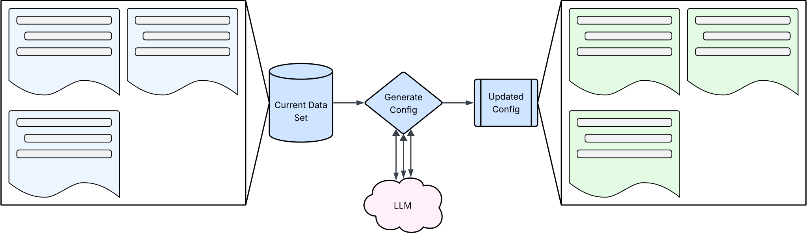
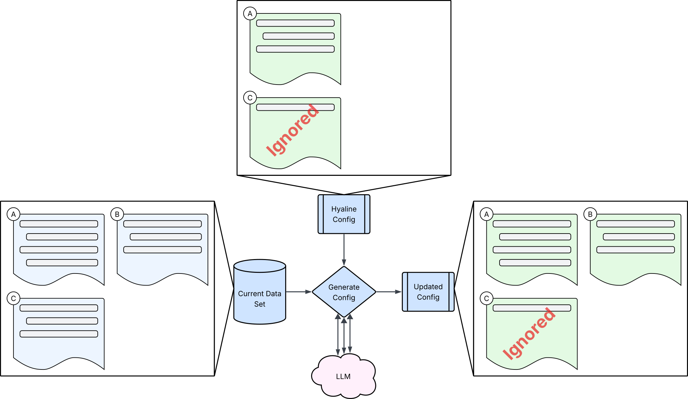
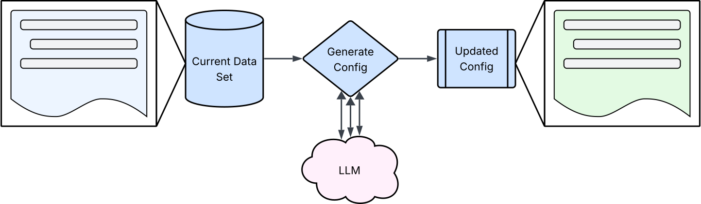

# Overview
Hyaline has the ability to generate a desired document configuration based on the current data set of extracted documents and sections (including generating purpose). This desired document set can then be hand-tweaked as needed to match organization goals and objectives.

Here you can see that we have a set of documents and sections extracted in the current data set on the left. Hyaline loops through those documents and sections, calling an llm for each if generating a purpose, and then outputs an updated configuration file (just the desired documents section) that can be used in the original configuration file (it does not update configuration files in place).

Please visit the [CLI Reference](../reference/cli.md) for more information about using generate config.

# Algorithm
Hyaline loops through each document in each documentation source in the extracted current data set and generates a desired document from it if the document does not already exist in the desired document set in the configuration. It then goes through each section in the document (if the document is not marked as ignored) and does the same for each actual section. Hyaline then writes out the new, combined configuration. 

In the image above you can see the extracted documents and sections in the current data set on the left and the current desired documents from the configuration on the top. Hyaline uses both the produce the updated configuration. For example:
* Document A is present in both the extracted current data set and in the configuration, but has an extra section that is not in the desired document configuration yet. Hyaline adds that section to the desired document configuration in the output.
* Document B is not present in the desired document configuration yet, so Hyaline adds it and all of its sections to the desired document configuration in the output.
* Document C is present in the current data set with 3 sections, and also present in the current desired document configuration. Because it is marked as ignored, Hyaline does not perform any updates to the desired document in the output configuration.

# Purpose
If desired, Hyaline can also generate purpose statements for each document and/or section by calling out to an LLM.

When configured to, Hyaline will also generate purpose statements for desired documents and sections that do not contain them. To do this it takes the contents of the document or section and calls an LLM to generate a purpose statement for the document and/or section, and then adds that to the updated configuration that is output.
