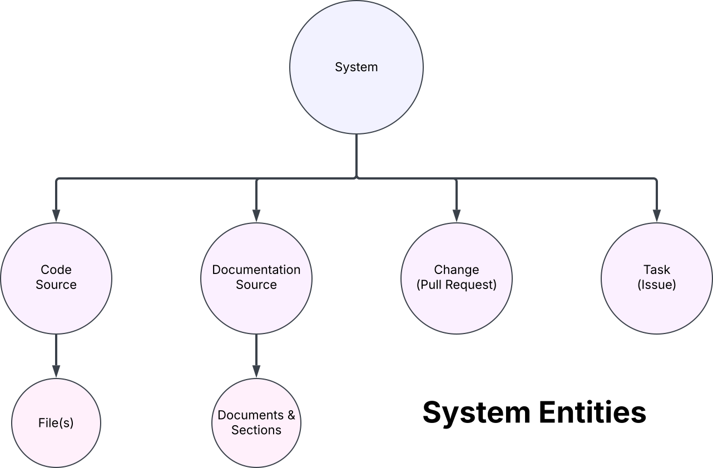
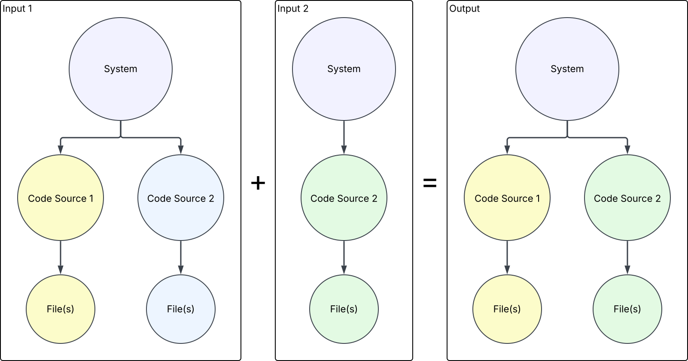

# Overview
Hyaline has the ability to merge data sets together. This can be used to create a single data set containing all current documentation, or to merge newly extracted data into an existing data set (for example when extracting to prepare for checking a change).

TODO image of different levels and what gets taken, show at what level merge replaces documentation, code, and metadata

TODO explanation of image, detail what is overwritten

# Example

TODO explanation of image