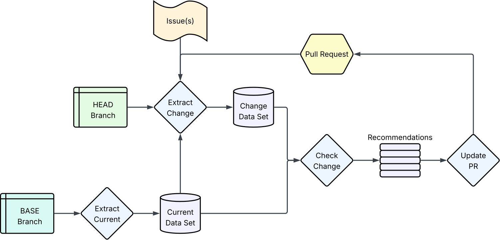

# Overview
Hyaline has the ability to create or update a comment on a GitHub PR with the results from a previous run of `check change`. When updating, it merges previous recommendations with new ones, as well as maintaining the status of items that have been addressed (either manually or via changes detected by `check change`).

TODO explanation of image

# Algorithm

TODO explanation of logic

# Data Displayed
TODO screenshot of example (annotate with boxes and arrows)

TODO explanation of example