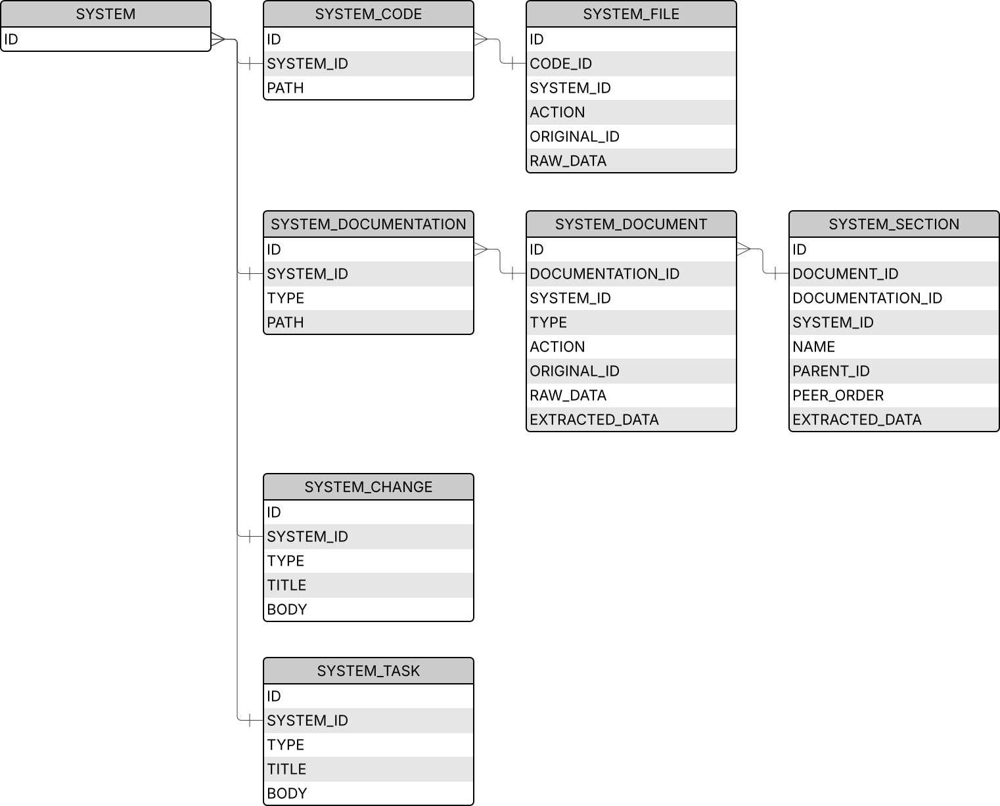

# Overview
This documents the database schema of the Hyaline Change Set as generated and stored in sqlite. Note that both current and change data sets share the same schema.

# Tables
The following tables make up a Hyaline Data Set.

## SYSTEM
Systems within Hyaline.

| Column | Type | Description |
|--------|------|-------------|
| ID | TEXT | The ID of the system, as defined in the config |

## SYSTEM_CODE
System code sources within Hyaline.

| Column | Type | Description |
|--------|------|-------------|
| ID | TEXT | The ID of the system code source, as defined in the config |
| SYSTEM_ID | TEXT | The ID of the system this code source belongs to |
| PATH | TEXT | The path of the code (see below for details) |

### PATH
The path, or location, of the code being extracted as defined in the config. The value of the path depends on the type of extractor. Possible values are detailed below:

| Extractor | Value |
|-----------|-------|
| **fs** | The value of `path` in the extractor options |
| **git** | The value of `path` in the extractor options if set, otherwise the value of `repo` in the extractor options |

## SYSTEM_FILE
Files belonging to system code sources within Hyaline.

| Column | Type | Description |
|--------|------|-------------|
| ID | TEXT | The ID of the file. This will be the path to the file relative to the SYSTEM_CODE.PATH |
| CODE_ID | TEXT | The ID of the system code source this file belongs to |
| SYSTEM_ID | TEXT | The ID of the system this file belongs to |
| ACTION | TEXT | Only set when extracting changes. The git action associated with this file in the case that a change is extracted. See **Enums > Action** below for possible values |
| ORIGINAL_ID | TEXT | Only set when extracting changes. The original file ID of this file if it was renamed |
| RAW_DATA | TEXT | The raw contents of this file |

## SYSTEM_DOCUMENTATION
System documentation sources within Hyaline.

| Column | Type | Description |
|--------|------|-------------|
| ID | TEXT | The ID of the system documentation source, as defined in the config |
| SYSTEM_ID | TEXT | The ID of the system this documentation source belongs to |
| TYPE | TEXT | The type of documentation. For possible values please see **Enums > Documentation Type** below |
| PATH | TEXT | The path of the documentation (see below for details) |

### PATH
The path, or location, of the documentation being extracted as defined in the config. The value of the path depends on the type of extractor. Possible values are detailed below:

| Extractor | Value |
|-----------|-------|
| **fs** | The value of `path` in the extractor options |
| **git** | The value of `path` in the extractor options if set, otherwise the value of `repo` in the extractor options |
| **http** | The parsed value of the baseUrl in the extractor options (`{scheme}://{host}`). Note that host includes port if set |

## SYSTEM_DOCUMENT
Documents belonging to system documentation sources within Hyaline.

| Column | Type | Description |
|--------|------|-------------|
| ID | TEXT | The ID of the document. This will be the path to the document relative to the SYSTEM_DOCUMENTATION.PATH |
| DOCUMENTATION_ID | TEXT | The ID of the system documentation source this document belongs to |
| SYSTEM_ID | TEXT | The ID of the system this document belongs to |
| TYPE | TEXT | The type of document. For possible values please see **Enums > Documentation Type** below |
| ACTION | TEXT | Only set when extracting changes. The git action associated with this document in the case that a change is extracted. See **Enums > Action** below for possible values |
| ORIGINAL_ID | TEXT | Only set when extracting changes. The original document ID of this document if it was renamed |
| RAW_DATA | TEXT | The raw contents of this document |
| EXTRACTED_DATA | TEXT | The data extracted from this document in markdown format. See [Extract Current](../explanation/extract-current.md) for how markdown is extracted from documents |

## SYSTEM_SECTION
Document sections extracted from documents belonging to system documentation sources within Hyaline.

| Column | Type | Description |
|--------|------|-------------|
| ID | TEXT | The ID of the section. See below for how it is calculated |
| DOCUMENT_ID | TEXT | The ID of the document this section belongs to |
| DOCUMENTATION_ID | TEXT | The ID of the system documentation source this section belongs to |
| SYSTEM_ID | TEXT | The ID of the system this section belongs to |
| NAME | TEXT | The name of this section |
| PARENT_ID | TEXT | The ID of the parent section (blank if no parent) |
| PEER_ORDER | TEXT(Parsed as int) | The order of this section amongst its peers (0 based) |
| EXTRACTED_DATA | TEXT | The data extracted from SYSTEM_DOCUMENT.EXTRACTED_DATA for this section. Note that this will contain the section contents including any child sections |

### ID
The ID is constructed by appending the section's title (including parent titles to the root of the document) to the Document ID separated by `#`. For example, the sub-section Foo (parent Bar) in README.md would have an ID of `README.md#Bar#Foo`. Note that any `#` symbols in the section titles are stripped, any pre or post whitespace is removed from the section title, and any internal whitespace in the title remains (for example `README.md#My Section#My Subsection` is valid).

## SYSTEM_CHANGE
System changes, such as pull requests, for systems within Hyaline.

| Column | Type | Description |
|--------|------|-------------|
| ID | TEXT | The ID of the change. See below for how it is calculated |
| SYSTEM_ID | TEXT | The ID of the system this change belongs to |
| TYPE | TEXT | The type of change. See **Enums > Change Type** below for possible values |
| TITLE | TEXT | The title of the change |
| BODY | TEXT | The contents of the change (in markdown) |

### ID
The Change ID is constructed based on the Type of change. The format for each type is detailed below:

| Type | Format |
|------|--------|
| **GITHUB_PULL_REQUEST** | `OWNER/REPO/ID` |

## SYSTEM_TASK

| Column | Type | Description |
|--------|------|-------------|
| ID | TEXT | The ID of the task. See below for how it is calculated |
| SYSTEM_ID | TEXT | The ID of the system this task belongs to |
| TYPE | TEXT | The type of task. See **Enums > Task Type** below for possible values |
| TITLE | TEXT | The title of the task |
| BODY | TEXT | The contents of the task (in markdown) |

# Enums
The following enums exist and are used in Hyaline data sets

## Action
| Value | Description |
|-------|-------------|
| `` | No action |
| `Insert` | A file or document was inserted |
| `Modify` | A file or document was modified |
| `Rename` | A file or document was renamed (may also have modifications) |
| `Delete` | A file or document was deleted |

## Documentation Type
| Value | Description |
|-------|-------------|
| `md` | Markdown |
| `html` | HTML |

## Change Type
| Value | Description |
|-------|-------------|
| `GITHUB_PULL_REQUEST` | A GitHub Pull Request |

## Task Type
| Value | Description |
|-------|-------------|
| `GITHUB_ISSUE` | A GitHub Issue |