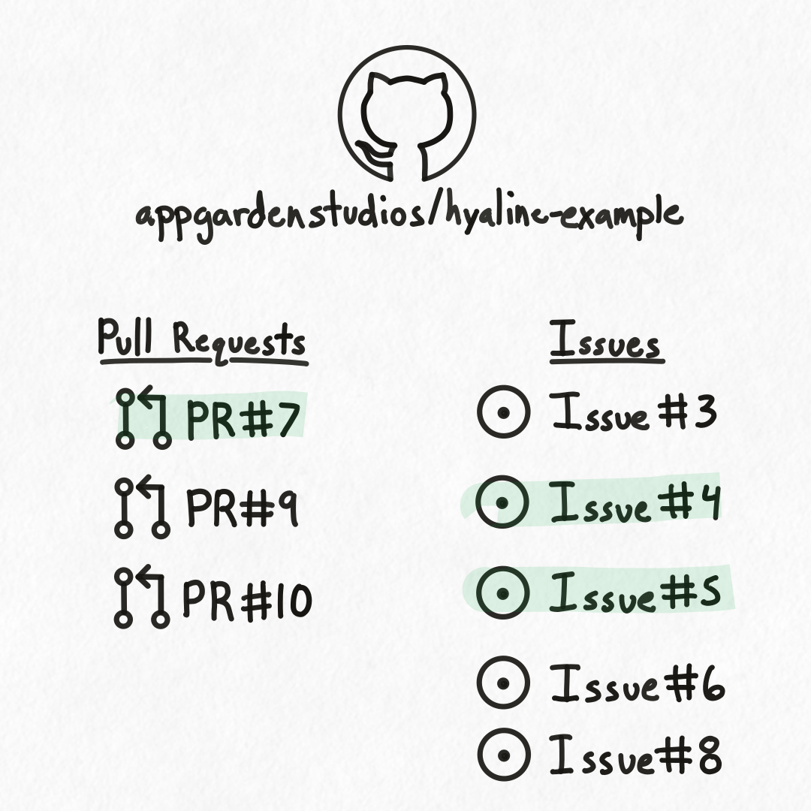

## Overview

<div class="portrait">


Hyaline has the ability to check code changes and recommend documentation updates based on the code that was updated. To support this process Hyaline utilizes several pieces of context and configuration to provide its recommendations.

**Diff**: Hyaline examines the code that was changed and bases its documentation updates on these changes.

**Current Documentation**: Hyaline uses the set of current documentation to determine which (if any) documents should be updated.

**Pull Request and Issues**: Hyaline supports pulling in a pull request and one or more issues to provide additional context to the changes.

**Config**: Hyaline uses information from the configuration file to determine which code and documentation to consider, as well as providing the ability to directly link code and documentation through "Update If" statements.

**AI/LLM**: Hyaline uses an LLM to help determine what documents should be updated for each code change by prompting it with the contents of the change, along with existing documentation and other related context.

Hyaline uses all of these resources to check either a diff (i.e. the difference between two branches of code) or the changes in a PR and determine which documents should be updated. It then formats the results of the check into a series of recommendations of which documents to examine and consider updating. Hyaline supports outputting recommendations as a JSON file as well as creating/updating a comment on the GitHub PR itself.

</div>

## Inputs
The following are context or resources used in the Check Process.

### Diff
Hyaline uses each code file changed in a diff as an input to the recommendation process, and provides fine grained configuration that allows you to select only the relevant files to consider while excluding irrelevant files like tests or vendored dependencies.

<div class="side-by-side">

```yml
check:
  code:
    include:
      - "**/*.js"
      - "package.json"
    exclude:
      - "old/**/*"
      - "**/*.test.js"
  ...
```


</div>

In the example above we have a configuration that includes all `.js` files in the repository along with the `package.json` file at the root of the repository. We also exclude anything in the `old/` directory along with any test files ending with `.test.js`. Using this configuration Hyaline will examine any changes in the following files: `components/app.js`, `components/header.js`, `index.js`, and `package.json`. Note that `components/app.test.js` and `components/header.test.js` are excluded because they match the exclude glob `**/*.test.js`. Also notice that both `old/app.js` and `old/header.js` are excluded because they match the exclude glob `old/**/*`. As a final note, the file `package-lock.json` was not included because it does not match any of the include rules.


### Current Documentation
Hyaline supports the ability to specify the set of documentation that should be considered when determining what documentation may need to be updated. This can be helpful in large organizations where a particular repository only affects a single system out of many, and narrowing the set of documentation considered can provide significant speed and cost savings.

<div class="side-by-side">

```yml
check:
  ...
  documentation:
    include:
      - source: "**/*"
    exclude:
      - source: infra
        document: docs/old-*
      - source: my-app
        document: CHANGELOG.md
  ...
```


</div>

In the example above we have a configuration that includes all documentation sources, meaning Hyaline will check for needed documentation updates across all sources in the current documentation data set. It also excludes 2 sets of documentation: any documents in the `infra` source in the `docs/` folder that start with `old-` and the document `CHANGELOG.md` in the `my-app` source. Using this configuration Hyaline will consider all available documentation except `docs/old-cluster.md` (because it matched the first exclude statement) and `CHANGELOG.md` (because it matched the second statement).

### Pull Request and Issues
Hyaline supports the ability to include context from a GitHub pull request and one or more issues when determining what set of documentation may need to be updated based on a change. This can be helpful as pull requests and issues can include notes or requirements stating documentation that should be updated.

<div class="side-by-side">

```bash
$ hyaline check diff /
  ...
  --pull-request /
    appgardenstudios/hyaline-example/7 /
  --issue /
    appgardenstudios/hyaline-example/4 /
  --issue /
    appgardenstudios/hyaline-example/5 /
  ...
```



</div>

In the example above we have the hyaline command `check diff` that is passing in a pull request and two issues. The image on the right lists the available issues and pull requests in the `appgardenstudios/hyaline-example` repo on GitHub. Hyaline will pull in the titles and bodies of Pull Request #7 and Issues #4 and #5 and them to the LLM's prompt context when considering the set of documentation that may need to be updated.

### UpdateIf Rules
Hyaline supports the ability to link code directly to relevant documentation via configuration. This linking is done by specifying an "update if" condition, where if certain code is updated then a set of documentation should also be updated. This can help in instances where changes to certain files (like routes or security rules) always need to be reflected in other documentation. Hyaline supports specifying that documentation needs to be updated if files are touched, added, modified, deleted, or renamed.

<div class="side-by-side">

```yaml
check:
  options:
    updateIf:
      touched:
        - code:
            path: "src/routes.js"
          documentation:
            source: "my-app"
            document: "docs/routes.md"
```


</div>

In the example above we have a configuration that specifies the the document `docs/routes.md` should be updated any time the file `src/routes.js` is touched. Note that the documentation does not need to be in the same repository/source as the code being checked, allowing you to keep disparate documentation in sync. when Hyaline checks for which documentation may need to be updated it detects changes to the file `src/routes.js` and adds the document `docs/routes.md` in the source `my-app` to the list of recommended updates with a reason referencing the configured update if statement.

### LLM Prompt
Hyaline prompts an LLM to determine which pieces of documentation (if any) should be updated for a specific code change. TODO talk about context provided.

TODO TODO

<div class="side-by-side">

```diff
--- src/server.js
+++ src/server.js
@@ -15,6 +15,9 @@ function serve() {
 }
 
 function isValidUrl(string) {
+  if (!string) {
+    return false;
+  }
   try {
     new URL(string);
     return true;
```


</div>


## Check Process

<div class="portrait">


TODO talk about process of looping through list

TODO portrait (square or portrait) image of check process (zoom in on) of looping through diffs to collect llm recommendations and updateIf matches, then merging everything together, then marking what documentation has already been updated.

</div>


## Recommendations

<div class="portrait">


output to json file or update PR

TODO square image of recommendations output from process to either json file or pr comment

</div>