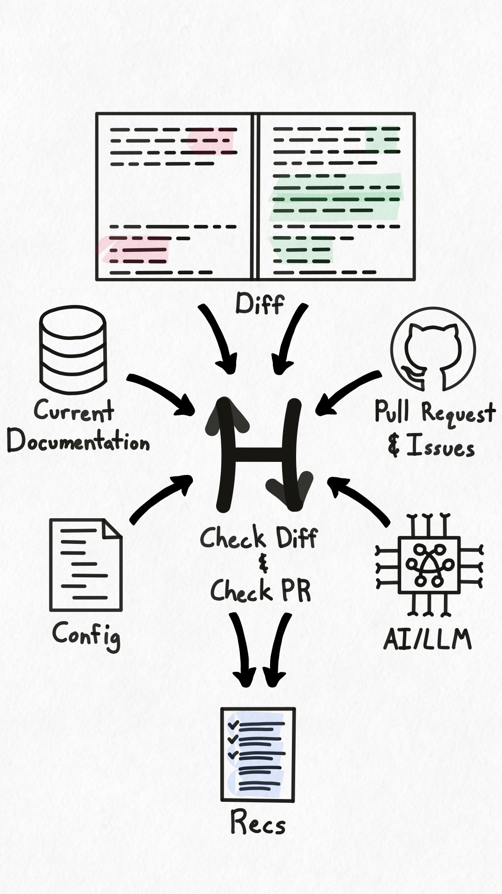

## Overview

<div class="portrait">



Hyaline has the ability to check code changes and recommend documentation updates based on the code that was updated. To support this process Hyaline utilizes several pieces of context and configuration to provide its recommendations.

**Diff**: Hyaline examines the code that was changed and bases its documentation updates on these changes.

**Current Documentation**: Hyaline uses the set of current documentation to determine which (if any) documents should be updated.

**Pull Request and Issues**: Hyaline supports pulling in a pull request and one or more issues to provide additional context to the changes.

**Config**: Hyaline uses information from the configuration file to determine which code and documentation to consider, as well as providing the ability to directly link code and documentation through updateIf statements.

**AI/LLM**: Hyaline uses an LLM to help determine what documents should be updated for each code change by prompting it with the contents of the change, along with existing documentation and other related context.

Hyaline uses all of these resources to check either a diff (i.e. the difference between two branches of code) or the changes in a PR and determine which documents should be updated. It then formats the results of the check into a series of recommendations of which documents to examine and consider updating. Hyaline supports outputting recommendations as a JSON file (for `check pr` and `check diff` commands) as well as creating/updating a comment on the GitHub PR itself (only done on `check pr`).

</div>

## Inputs
The following are context or resources used in the Check Process.

### Diff
Hyaline uses each code file changed in a diff as an input to the recommendation process, and provides fine grained configuration that allows you to select only the relevant files to consider while excluding irrelevant files like tests or vendored dependencies.

<div class="side-by-side">

```yml
check:
  code:
    include:
      - "**/*.js"
      - "package.json"
    exclude:
      - "old/**/*"
      - "**/*.test.js"
  ...
```


</div>

In the example above we have a configuration that includes all `.js` files in the repository along with the `package.json` file at the root of the repository. We also exclude anything in the `old/` directory along with any test files ending with `.test.js`. Using this configuration Hyaline will examine any changes in the following files: `components/app.js`, `components/header.js`, `index.js`, and `package.json`. Note that `components/app.test.js` and `components/header.test.js` are excluded because they match the exclude glob `**/*.test.js`. Also notice that both `old/app.js` and `old/header.js` are excluded because they match the exclude glob `old/**/*`. As a final note, the file `package-lock.json` was not included because it does not match any of the include rules.


### Current Documentation
Hyaline supports the ability to specify the set of documentation that should be considered when determining what documentation may need to be updated. This can be helpful in large organizations where a particular repository only affects a single system out of many, and narrowing the set of documentation considered can provide significant speed and cost savings.

<div class="side-by-side">

```yml
check:
  ...
  documentation:
    include:
      - source: "**/*"
    exclude:
      - source: infra
        document: docs/old-*
      - source: my-app
        document: CHANGELOG.md
  ...
```


</div>

In the example above we have a configuration that includes all documentation sources, meaning Hyaline will check for needed documentation updates across all sources in the current documentation data set. It also excludes 2 sets of documentation: any documents in the `infra` source in the `docs/` folder that start with `old-` and the document `CHANGELOG.md` in the `my-app` source. Using this configuration Hyaline will consider all available documentation except `docs/old-cluster.md` (because it matched the first exclude statement) and `CHANGELOG.md` (because it matched the second statement).

### Pull Request and Issues
Hyaline supports the ability to include context from a GitHub pull request and one or more issues when determining what set of documentation may need to be updated based on a change. This can be helpful as pull requests and issues can include notes or requirements stating documentation that should be updated.

<div class="side-by-side">

```bash
$ hyaline check diff /
  ...
  --pull-request /
    appgardenstudios/hyaline-example/7 /
  --issue /
    appgardenstudios/hyaline-example/4 /
  --issue /
    appgardenstudios/hyaline-example/5 /
  ...
```


</div>

In the example above we have the hyaline command `check diff` that is passing in a pull request and two issues. The image on the right lists the available issues and pull requests in the `appgardenstudios/hyaline-example` repo on GitHub. Hyaline will pull in the titles and bodies of `Pull Request #7` and `Issues #4` and `#5` and add them to the LLM's prompt context when considering the set of documentation that may need to be updated.

### UpdateIf Rules
Hyaline supports the ability to link code directly to relevant documentation via configuration. This linking is done by specifying an updateIf condition, where if certain code is updated then a set of documentation should also be updated. This can help in instances where changes to certain files (like routes or security rules) always need to be reflected in other documentation. Hyaline supports specifying that documentation needs to be updated if files are touched, added, modified, deleted, or renamed.

<div class="side-by-side">

```yaml
check:
  options:
    updateIf:
      touched:
        - code:
            path: "src/routes.js"
          documentation:
            source: "my-app"
            document: "docs/routes.md"
```


</div>

In the example above we have a configuration that specifies the document `docs/routes.md` should be updated any time the file `src/routes.js` is touched. Note that the documentation does not need to be in the same repository/source as the code being checked, allowing you to keep disparate documentation in sync. when Hyaline checks for which documentation may need to be updated it detects changes to the file `src/routes.js` and adds the document `docs/routes.md` in the source `my-app` to the list of recommended updates with a reason referencing the configured updateIf statement.

### LLM Prompt
Hyaline prompts an LLM to determine which pieces of documentation (if any) should be updated for a specific code change. Hyaline provides the code change, a list of document and sections (along with their purpose if available), and the pull request and issues (if provided) to the LLM to help it determine which documents and/or sections should be updated.

<div class="side-by-side">

```diff
--- src/server.js
+++ src/server.js
@@ -15,6 +15,9 @@ function serve() {
 }
 
 function isValidUrl(string) {
+  if (!string) {
+    return false;
+  }
   try {
     new URL(string);
     return true;
```


</div>

In the example above we have a code file diff under examination. Hyaline provides the diff, a list of documents and sections, the pull request, and any issues provided to the LLM as context for the prompt. Then the prompt asks the LLM to use the documentation, diff, and other context to determine what documentation (if any) should be updated.

## Check Process

<div class="portrait">


When Hyaline performs a check on a diff or PR it collects all of the relevant context it needs, such as the list of code files that have changed and are in scope, the set of documentation to consider, and the contents of a pull request or issues. Once collected, Hyaline checks for needed documentation updates in a 3 step process:

**1: Check each Changed File** - Hyaline loops through each changed file in the diff and evaluates it to see what documentation may need to be updated. It makes a single call to an LLM passing in context and prompting it to respond with a list of documents and/or sections that may need to be updated along with the reason why. It also looks at the configuration file to see if there are any updateIf statements that apply to the changed file. The resulting set of documents and sections that may require updates is then returned.

**2: Collate the Results** - Hyaline then takes the set of documents and sections that may require updates, along with the reason(s) provided, and collates them into a single unified set of recommendations. This set  of recommendations contains a sorted list of documents and sections with the reason(s) they may need to be updated attached to each document or section.

**3: Check for Documentation Changes** - Once the set of recommendations is collated Hyaline scans the diff and updates the recommendations to mark any documents that have been changed as a part of the diff. Note that this step is only done if Hyaline is configured to do so. For more information on configuring Hyaline to detect and mark changed documents please see the configuration option `detectDocumentationUpdates` in the [configuration reference](../reference/config.md).

</div>


## Recommendations

<div class="portrait">


Once Hyaline has generated a set of recommendations they can either be output as a JSON file (using the `--output` option) or added as a comment to the pull request (only available for `hyaline check pr`).

For `hyaline check pr`, the `--output` option outputs the combined recommendations of the previous and current run. In order to output the recommendations from the current run, you can provide the `--output-current` option. Similarly, the previous recommendations can be output by providing the `--output-previous` option.

The schema for the recommendations output can be viewed [here](../reference/recommendations.md).

The comment on the pull request contains the following:

- The Git SHA of the commit that was compared
- A list of recommendations where each one has:
  - A checkbox used to indicate that the recommendation for the document/section has been addressed
  - The name the document (and section if applicable)
  - The system and documentation source name
  - The list of reasons the documentation should be updated

</div>

### Pull Request Comment Updates

<div class="portrait">


If `hyaline check pr` is run more than once for the same PR, Hyaline will update the previous comment instead of creating a new one. This ensures that the comment from Hyaline always stays up-to-date with the latest changes. When updating Hyaline merges the original set of recommendations with the new set as follows:

1. Any original recommendation for a document or section that does not have a corresponding match in the new set is copied over as is.
2. Any new recommendation for a document or section that does not have a corresponding match in the original set is used as is.
3. Any original recommendation for a document or section that does have a match in the new set is merged, and the new set of reasons is appended to the original set of reasons before being used.
4. The final set of recommendations is sorted by source, document, and section

Note that the state of the checkboxes are preserved, allowing you to track which recommendations have been addressed. Hyaline will automatically check the box if it detects that the document has been updated as a part of the PR (provided it is configured to perform that check).

</div>