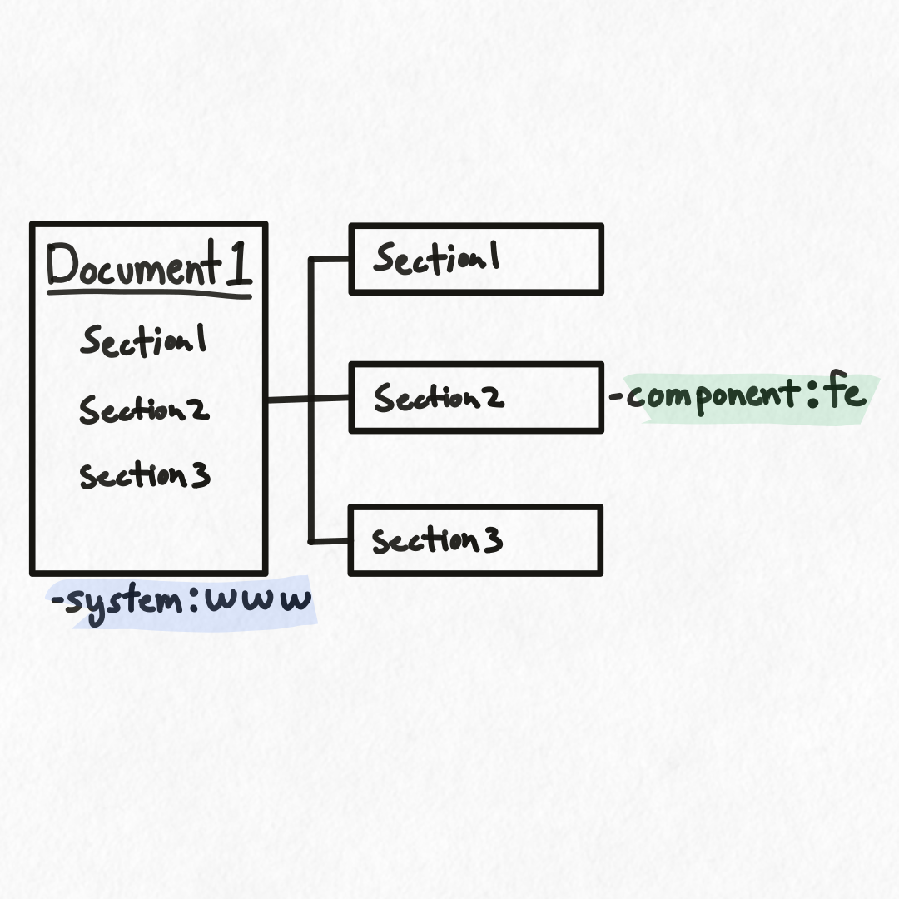

## Overview

<div class="portrait">


TODO portrait image of multiple repos/sites, extract into current data set, can audit (right), used for check on changes (left), used by AI (mcp lower left), used by org (lower right)

Hyaline has the ability to extract documentation into a current data set that can be used to build systems and products as well as verify that the documentation is accurate and complete.

In this example you can see documentation spread over multiple repositories and documentation sites. Hyaline can extract documentation from each of these, (optionally) [merge](./merge.md) them together into a unified documentation set, and then use Hyaline to [check](./check.md) and [audit](./audit.md) the extracted documentation or use it via an [MCP server](./mcp.md) or referencing the [current data set](../reference/data-set.md). 

In Hyaline repository or documentation site is a documentation source, or source for short. 

</div>

<div class="portrait">


Extracting documentation is broken up into 3 phases: Crawling, Extracting, and Adding Metadata

TODO talk high level about each phase

TODO talk about tags

</div>

## Crawling Documentation

<div class="portrait">


Hyaline can be configured to crawl a documentation source and extract documentation. Hyaline supports a number of different crawlers, each with their own capabilities and configuration.

- **fs** - The file system crawler looks for documentation on a local filesystem.
- **git** - The git crawler looks for documentation on a specific branch or reference of a git repository.
- **http** - The http crawler looks for documentation on a local or remote http or https server.

Read more about each of these extractors and how they operate below.

</div>

### Crawling Documentation - fs

The `fs` crawler crawls a local filesystem starting at a path, and processes each document it encounters.

<div class="side-by-side">

```yml
extract:
  ...
  crawler:
    type: fs
    options:
      path: ./my-app
    include:
      - "**/*.md"
    exclude:
      - "old/**/*"
      - "LICENSE.md"
  ...
```


</div>

In this example you can see that Hyaline is configured to start crawling in the `./my-app` directory and process any documents that match `**/*.md`. Hyaline processes all of the markdown documents in the `contributing/` directory and `src/` directory. Hyaline does not process the markdown file in the `old/` directory as everything in that directory is excluded. Hyaline also processes the `README.md` file at the root of the path but does not the `License.md` file as that file is excluded.


### Crawling Documentation - git

The `git` crawler crawls a git repository starting at its root, and processes each document it encounters.

<div class="side-by-side">

```yml
extract:
  ...
  crawler:
    type: git
    options:
      repo: git@github.com:o/my-app.git
      clone: true
      branch: main
    include:
      - "**/*.md"
    exclude:
      - "internal/old.md"
      - "releases/2021*"
  ...
```


</div>

In this example you can see that Hyaline is configured to clone the remote repo `git@github.com:o/my-app.git` into memory and process any documents on branch `main` that match `**/*.md`. Hyaline processes the documents `cmd/env.md`, `internal/arch.md`, and `README.md` as they match the include. It does not process `internal/old.md` as that document is explicitly excluded. It also only processes documents in the release directory that do not start with `2021` as those document are excluded.

### Crawling Documentation - http

The `http` crawler crawls a HTTP or HTTPS website starting at a configured starting url, and processes each document it encounters.

<div class="side-by-side">

```yml
extract:
  ...
  crawler:
    type: http
    options:
      baseUrl: https://my-app.com/docs/
    include:
      - "**/*"
    exclude:
      - "roadmap"
  ...
```


</div>

In this example you can see that Hyaline is configured to start crawling at `https://my-app.com/docs/` and process any documents that match `**/*`. Note that this pattern matching is scoped to the starting URL. Hyaline processes the linked documents in the `/docs/` directory with the exception of `/docs/roadmap`. Also, even though the document `/docs/getting-started` links to `/contact`, it is not processed as it does not match any include statements which.

Note that Hyaline will not crawl outside of the specified domain, so you don't need to worry about it getting lost in the internet.

Also note that you can configure the `baseURL` independently of the starting URL. Please see the [extract config documentation](../reference/config.md) for more information.

## Extracting Documentation

<div class="portrait">


Hyaline can be configured to extract documentation differently based on the type of documentation encountered. Hyaline supports a number of different extractors, each with their own capabilities and configuration.

TODO talk about extractor cascade, as the first extractor matching the document is used.

</div>

### Extracting Documentation - md

The `markdown` extractor extracts markdown documents.

<div class="side-by-side">

```yml
extract:
  ...
  extractors:
    - type: md
      include:
        - "**/*.md"
  ...
```


</div>

In this example you can see the markdown document being extracted into a document and its sections based on the configured extractor.


### Extracting Documentation - html

The `html` extractor extracts html documents by extracting the content of the documentation and transforming it into markdown.

<div class="side-by-side">

```yml
extract:
  ...
  extractors:
    - type: html
      options:
        selector: main
      include:
        - "**/*"
  ...
```


</div>

In this example you can see an html document being extracted into a document and its sections. Hyaline is configured to select just the html in the `main` tag, which is then transformed into markdown and stored as a document and sections.

### A Note on Sections

TODO Hyaline scans the markdown document and extracts any sections it encounters. It identifies each section by name, and preserves any section level hierarchy it find.

Note that when storing the ID of the section it replaces any "/" characters with "_", as Hyaline uses "/" to separate sections in the ID if a sub-section (i.e. `Section 1/Section 1.1`).

## Adding Metadata

<div class="portrait">


Hyaline can be configured to add tags and purposes to each document and section that is extracted.

TODO talk about metadata and purpose and tags and what they are used for.

</div>

### Adding Metadata - Purpose

TODO purpose can be added and is used for 

<div class="side-by-side">

```yml
extract:
  ...
  metadata:
    - document: "Document 1"
      purpose: ABC
    - document: "Document 1"
      section: "Section 1"
      purpose: XYZ
  ...
```


</div>

In this example you can see a set of documents that have been extracted. Based on the configuration `Document 1` has its purpose set to `ABC`, and `Document 2 > Section 1` has its purpose set to `XYZ`.

### Adding Metadata - Tags

TODO purpose can be added and is used for 

<div class="side-by-side">

```yml
extract:
  ...
  metadata:
    - document: "**/*"
      tags:
        - key: system
          value: my-app
    - document: "Document 1"
      section: "Section 2"
      tags:
        - key: component
          value: fe
  ...
```



</div>

In this example you can see a document that have been extracted. Based on the configuration `Document 1` has the tag `system` set to `my-app`, and `Document 1 > Section 2` has the tag `component` set to `fe`. Note that you can set as many tags on each document and/or section as you wish.

## Next Steps
TODO
