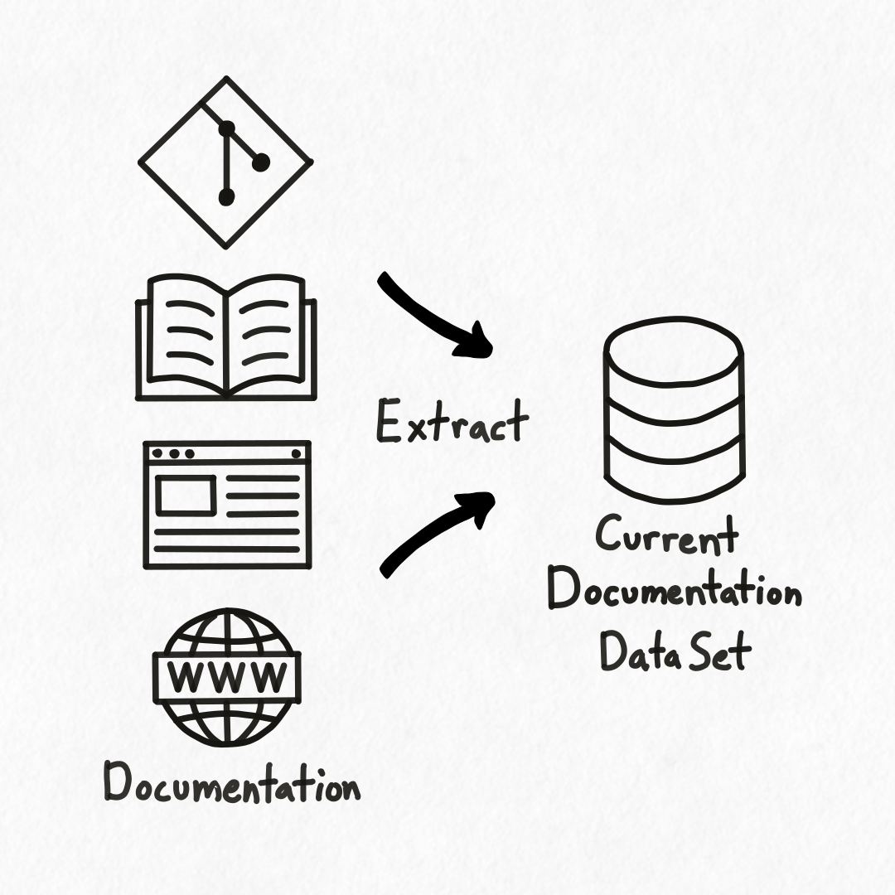

## Overview

<div class="portrait">



Hyaline has the ability to extract documentation into a current data set that can be used to build systems and products as well as verify that the documentation is accurate and complete.

In this example you can see documentation spread over multiple repositories and documentation sites. Hyaline can extract this documentation into a current [documentation data set](../reference/data-set.md) and make it available for use.

This documentation data set can be used in many different ways. Documentation can be [merged](./merge.md) together into a unified documentation set or used to [check](./check.md) and [audit](./audit.md) the extracted documentation. It can also be used via an [MCP server](./mcp.md) or by the organization for a variety of other purposes. 

Each repository or documentation site is considered a documentation source, or source for short. All of the documentation in a source is crawled and extracted in a single pass, and then tagged and enhanced with additional metadata. Hyaline supports a number of different crawlers and extractors to make sure you can get all of your documentation extracted and available for use.

</div>

<div class="portrait">


Extracting documentation is broken up into 3 distinct phases: **Crawl**, **Extract**, and **Add Metadata**.

**Crawl** is where Hyaline starts in a particular directory, repository, or website and scans it for available documentation. Each document it finds is saved off and passed to an appropriate extractor.

**Extract** is where Hyaline takes the raw document that was crawled and extracts documentation from it. Because Hyaline deals in markdown documentation, any document that is in another format is converted into markdown and stored. Once converted to markdown (if needed), Hyaline stores the document and sections in a current data set.

**Add Metadata** is where Hyaline applies additional metadata, like tags and purposes, to extracted documents and sections. This allows you to explicitly categorize and enhance the extracted documentation with information that is useful when checking, auditing, reading, or otherwise using the documentation.

</div>

## Crawling Documentation

<div class="portrait">


Hyaline can be configured to crawl a documentation source and extract documentation. Hyaline supports a number of different crawlers, each with their own capabilities and configuration.

- **fs** - The file system crawler looks for documentation on a local filesystem.
- **git** - The git crawler looks for documentation on a specific branch or reference of a git repository.
- **http** - The http crawler looks for documentation on a local or remote http or https server.

Read more about each of these extractors and how they operate below.

</div>

### Crawling Documentation - fs

The `fs` crawler crawls a local filesystem starting at a path, and processes each document it encounters.

<div class="side-by-side">

```yml
extract:
  ...
  crawler:
    type: fs
    options:
      path: ./my-app
    include:
      - "**/*.md"
    exclude:
      - "old/**/*"
      - "LICENSE.md"
  ...
```


</div>

In this example you can see that Hyaline is configured to start crawling in the `./my-app` directory and process any documents that match `**/*.md`. Hyaline processes all of the markdown documents in the `contributing/` directory and `src/` directory. Hyaline does not process the markdown file in the `old/` directory as everything in that directory is excluded. Hyaline also processes the `README.md` file at the root of the path but does not process the `License.md` file as that file is excluded.

### Crawling Documentation - git

The `git` crawler crawls a git repository starting at its root, and processes each document it encounters.

<div class="side-by-side">

```yml
extract:
  ...
  crawler:
    type: git
    options:
      repo: git@github.com:o/my-app.git
      clone: true
      branch: main
    include:
      - "**/*.md"
    exclude:
      - "internal/old.md"
      - "releases/2021*"
  ...
```


</div>

In this example you can see that Hyaline is configured to clone the remote repo `git@github.com:o/my-app.git` into memory and process any documents on branch `main` that match `**/*.md`. Hyaline processes the documents `cmd/env.md`, `internal/arch.md`, and `README.md` as they match the include. It does not process `internal/old.md` as that document is explicitly excluded. It also only processes documents in the release directory that do not start with `2021` as those document are excluded.

### Crawling Documentation - http

The `http` crawler crawls an HTTP or HTTPS website starting at a configured starting url, and processes each document it encounters.

<div class="side-by-side">

```yml
extract:
  ...
  crawler:
    type: http
    options:
      baseUrl: https://my-app.com/docs/
    include:
      - "**/*"
    exclude:
      - "roadmap"
  ...
```


</div>

In this example you can see that Hyaline calculates a starting url of `https://my-app.com/docs/` based off of the `baseUrl` and an optional `start` path (not shown here). Hyaline then starts crawling at `https://my-app.com/docs/` and processes any documents that match `**/*`. Note that the include and exclude glob matching is scoped to the `baseUrl`. Hyaline processes the linked documents in the `/docs/` directory with the exception of `/docs/roadmap` (which is excluded). Also note that even though the document `/docs/getting-started` links to `/contact`, `/contact` is not processed as it does not match any include statements.

Note that Hyaline will not crawl outside of the specified domain, so you don't need to worry about it getting lost in the internet.

Also note that you can configure the `baseURL` independently of the starting URL. Please see the [extract config documentation](../reference/config.md) for more information.

## Extracting Documentation

<div class="portrait">


Hyaline can be configured to extract documentation differently based on the type of documentation encountered. Hyaline supports a number of different extractors, each with their own capabilities and configuration.

- **md** - The markdown extractor handles raw markdown documents
- **html** - The html extractor converts html to markdown before extracting the document and section(s)

Note that the first matching extractor is used for each document, allowing you to extract multiple different document formats from the same source in a single pass.

</div>

### Extracting Documentation - md

The `markdown` extractor extracts markdown documents.

<div class="side-by-side">

```yml
extract:
  ...
  extractors:
    - type: md
      include:
        - "**/*.md"
  ...
```


</div>

In this example you can see the markdown document being extracted into a document and its sections based on the configured extractor.


### Extracting Documentation - html

The `html` extractor extracts html documents by extracting the content of the documentation and transforming it into markdown.

<div class="side-by-side">

```yml
extract:
  ...
  extractors:
    - type: html
      options:
        selector: main
      include:
        - "**/*"
  ...
```


</div>

In this example you can see an html document being extracted into a document and its sections. Hyaline is configured to select just the html in the `main` tag, which is then transformed into markdown and stored as a document and sections.

### A Note on Sections

Hyaline scans the markdown document and extracts any sections it encounters. It identifies each section by name, and preserves any section level hierarchy it finds when saving the sections to the data set.

Note that when Hyaline stores the ID of the section it replaces any "/" characters with "_". Hyaline uses "/" when generating an ID for a sub-section, as the ID includes the name(s) of the parent sections as well as the name of the sub-section (e.g. `Section 1/Section 1.1`).

## Adding Metadata

<div class="portrait">


Hyaline can be configured to add tags and purposes to each document and section that is extracted.

**Tags** are key-value pairs that can be associated with a document or section and then used for filtering and retrieval when checking, referencing, or otherwise using the documentation.

**Purpose** is the declared purpose of the document. It is used when checking which documentation needs to be updated for a particular code change, as it is typically a better indicator of what the document or section is intended to contain as compared to the contents itself (which may be out of date, incomplete, or entirely absent).

</div>

### Adding Metadata - Purpose

Purpose can be added to each matching document and/or section for later use.

<div class="side-by-side">

```yml
extract:
  ...
  metadata:
    - document: "Document 1"
      purpose: ABC
    - document: "Document 2"
      section: "Section 1"
      purpose: XYZ
  ...
```


</div>

In this example you can see a set of documents that have been extracted. Based on the configuration `Document 1` has its purpose set to `ABC`, and `Document 2 > Section 1` has its purpose set to `XYZ`.

### Adding Metadata - Tags

Tags can be added to each matching document and/or section for later use.

<div class="side-by-side">

```yml
extract:
  ...
  metadata:
    - document: "**/*"
      tags:
        - key: system
          value: my-app
    - document: "Document 1"
      section: "Section 2"
      tags:
        - key: component
          value: fe
  ...
```


</div>

In this example you can see a document that have been extracted. Based on the configuration `Document 1` has the tag `system` set to `my-app`, and `Document 1 > Section 2` has the tag `component` set to `fe`. Note that you can set as many tags on each document and/or section as you wish.

## Next Steps
Read on about how [checking documentation](./check.md) works, or visit the [configuration reference documentation](../reference/config.md) to see how to configure Hyaline to extract your documentation.
