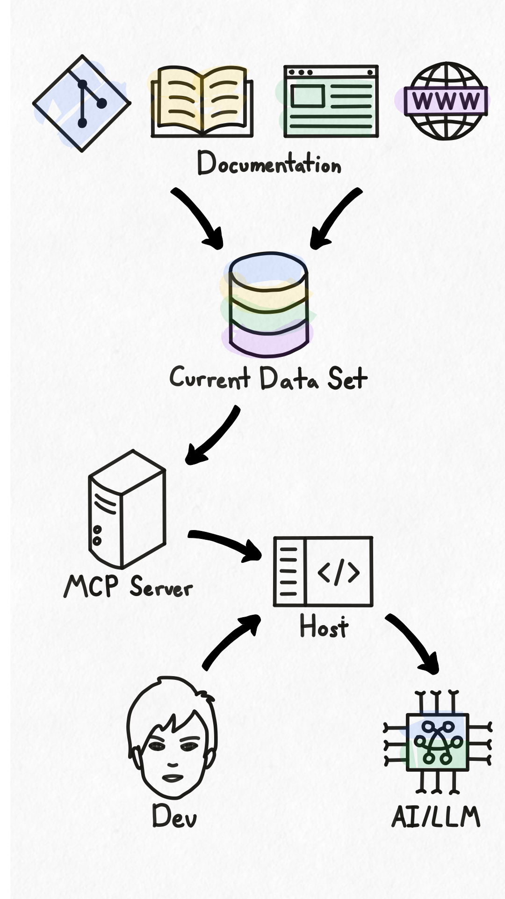

## Introduction
Hyaline is intended to help software development teams use their documentation to build and maintain their products. To that end Hyaline has two primary objectives: 1) help teams create, update, and maintain their documentation so that they can 2) use their documentation to create, maintain, and ship their products.

## Use Cases
To help you understand a bit more about what Hyaline does and does not do, consider the following:

**Use cases that Hyaline is intended to support**:
* Identify documentation that needs to be updated when a software change is implemented - Hyaline can examine your code changes and help identify what documentation needs to be updated and why
* Identify documentation that does not match its intended purpose or is incomplete - Hyaline can scan your existing documentation and ensure that each document and section matches your intended purpose and is complete.
* Ensure that certain documentation, including documentation that is required for regulatory or compliance purposes, is consistently created and maintained - Hyaline can be configured to use centralized rules to ensure certain documentation is present and updated across all of your products and systems.
* Allow an LLM to scan, search, and use your documentation to help you build your product(s) - Hyaline extracts and indexes all of your documentation, and makes that information available through an [MCP server](https://modelcontextprotocol.io).

**Use cases that Hyaline is not intended to support**:
* Creating and/or updating documentation without human involvement - Hyaline is intended to _augment_ team members, not replace them.
* Extracting or storing 3rd party documentation such as API/Library documentation.

## Workflow

In this workflow people, assisted by AI, build products and systems. While doing so they create and update Documentation. That documentation is then read and used by people to build products and systems, and the cycle continues. Hyaline sits in between People/AI and Documentation, and is intended to assist in both creating/updating documentation and reading/using documentation to build products and systems.

## Extract

TODO talk about extract and merge

TODO talk about organization by source and link to data-set reference.

## Check

TODO talk about check

## Audit

TODO talk about audit

## MCP

TODO talk about mcp

## Next Steps
Continue reading about various Hyaline concepts such as [extract](./extract.md), or get started by visiting [how to install the cli](../how-to/install-cli.md).