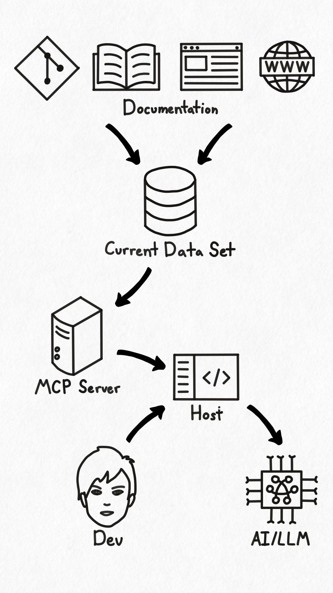
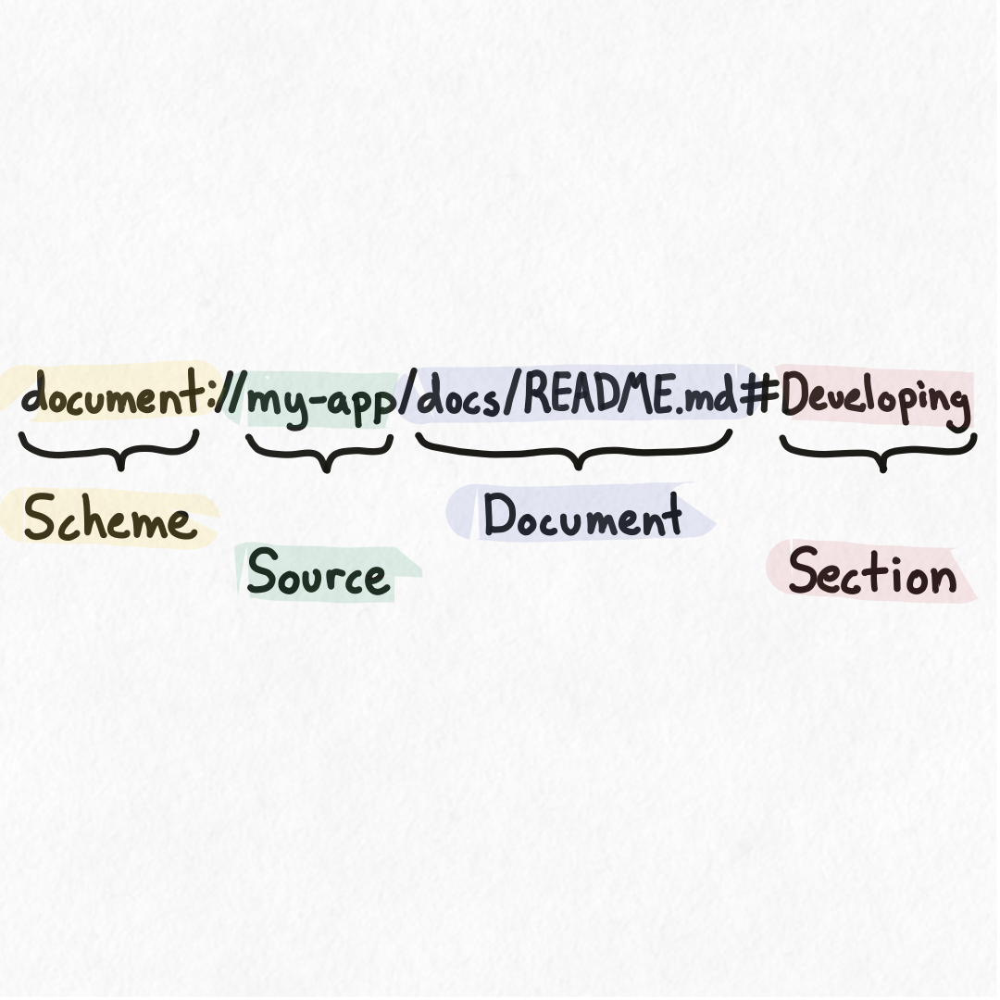

## Overview

Hyaline has a built-in MCP server that can make your documentation available to LLM models via the [Model Context Protocol](https://modelcontextprotocol.io/introduction) (MCP). First, you use Hyaline to [extract](./extract-documentation.md) all of your documentation into a documentation data set. This data set is stored in an SQLite database and can be sent, shared, or used independently of Hyaline if you wish. Once the documentation data set is complete, you install Hyaline's MCP server in your host of choice (i.e. Claude Desktop) and point Hyaline to that data set. Once configured, your AI assistant will have the ability to list and retrieve all of your documentation that is stored in your documentation data set. Then, when you as a developer ask your LLM to complete a task that requires documentation, your LLM can use the tools exposed by the MCP server via the host to list and retrieve relevant documentation.

Please visit the [MCP reference](../reference/mcp.md) for more detailed information on the tools made available by the MCP server.

## Concepts

### Organization

Hyaline extracts and stores documentation organized by documentation sources. For example, the documentation sources could include 1) the development oriented documentation checked into the repository alongside the code (README and other markdown files), 2) operations oriented documentation stored in an internal wiki, 3) customer focused documentation stored on a website, etc...

Inside each documentation source is a set of documents. A document is either a single markdown file or html page that was discovered and saved during the extraction process. Additionally, Hyaline parses each document and extracts the section hierarchy, meaning that Hyaline can reference not just a specific document but also specific sections within the document.

### URIs

Hyaline constructs a URI to identify each extracted document and section. The format of the URI is `document://<source-id>/<document-id>[#<section>]` and is constructed as follows:

- `<source-id>` is the globally unique ID of the documentation source as defined when extraction takes place
- `<document-id>` is the relative path of the document from the root of the extraction (similar to what we use now for the document ID)
- `<section>` is optional and contains the name of the section. For sub-sections, the name of each parent section is prepended and separated by `#` (e.g. `#section1#subsection2`)

### Filtering

The MCP server supports two types of filtering:

#### Prefix Filtering
When you provide a partial URI path, the server will return all documents that match the prefix. For example:
- `document://product-docs` returns all documents in the "product-docs" source
- `document://api-docs` returns all documents in the "api-docs" source

#### Tag Filtering
Documents and sections can have tags associated with them. You can filter results by including query parameters in the URI:

- **Multiple values for same tag**: When you specify multiple comma-separated values for the same tag key (e.g., `?audience=user,admin`), documents that have ANY of those tag values will be included
- **Multiple tags**: When you specify multiple different tags (e.g., `?audience=user&level=beginner`), documents must match at least one value for EACH tag to be included

Example filtering URIs:
- `document://product-docs?audience=user` - returns documents tagged with "user"
- `document://product-docs?audience=user,admin` - returns documents tagged with either "user" OR "admin"
- `document://product-docs?audience=user&level=beginner` - returns documents tagged with "user" AND "beginner"

## Next Steps
You can go read the [MCP reference](../reference/mcp.md) to see details on the tools exposed by the MCP server, or go and view the [CLI reference](../reference/cli.md) to see how to run the MCP server.