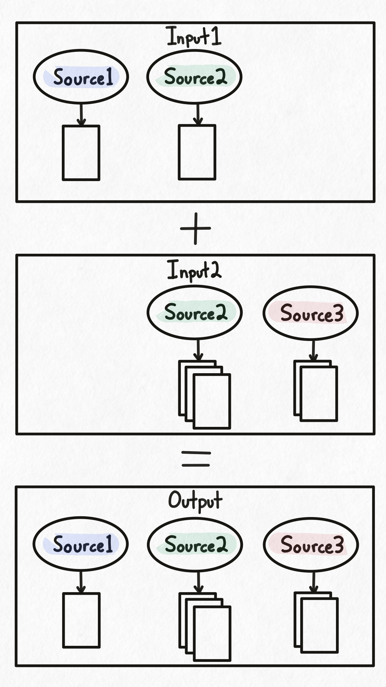

## Overview

Hyaline has the ability to merge documentation data sets together. This can be used to create a single data set containing all current documentation, or to merge newly extracted documentation into an existing data set.

Merging happens at the source level. If a source being merged in does not yet exist in the data set, the source is pulled in wholesale. If a source being merged in already exists, the documents, sections, and tags from the new source completely replace the old source.

## Example

In this example, we have two input databases and want to merge them into a single output database. **Input 1** contains **Source 1** and **Source 2**, each with their own documents. **Input 2** contains **Source 2** and **Source 3**, where **Source 2** has multiple documents that were not present in **Source 2** from **Input 1**.

When merging, Hyaline does the following:
- **Source 1** exists only in **Input 1**, so it's copied entirely to the output
- **Source 2** exists in both inputs, so the version from **Input 2** overwrites the version from **Input 1** (later inputs take precedence)
- **Source 3** exists only in **Input 2**, so it's copied entirely to the output

The final output database contains all three sources: **Source 1** from **Input 1**, **Source 2** from **Input 2**, and **Source 3** from **Input 2**.

