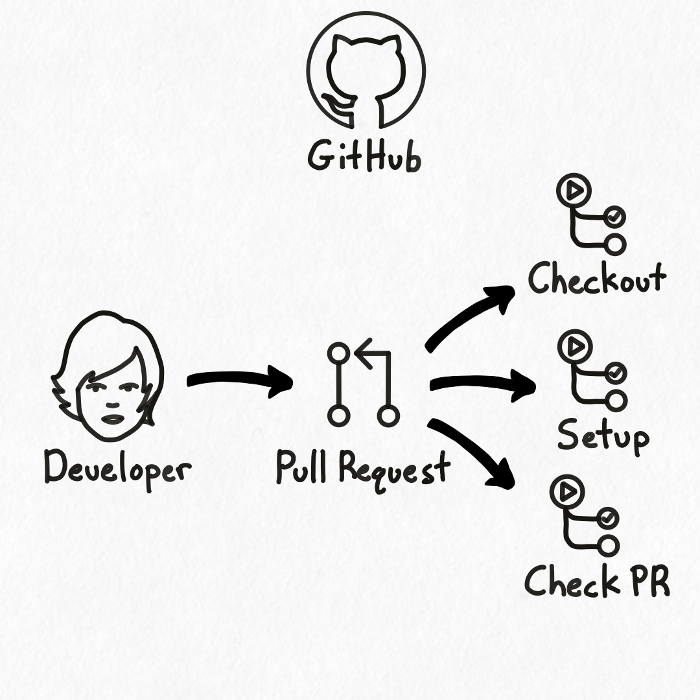

## Overview

<div class="portrait">



Hyaline comes with a set of [GitHub Actions](https://github.com/features/actions) that allows you to setup and use Hyaline within a GitHub workflow.

When a developer pushes code to a Pull Request in GitHub, one or more GitHub Actions are triggered. Those actions can then run jobs such as checking out code, installing Hyaline, ensuring a pull request is updating all applicable documentation, etc.

Hyaline provides the following GitHub Actions:

- **Setup** - Install and Setup Hyaline in your workflow
- **Check PR** - Check a PR for recommended documentation updates

</div>

## Setup
The [setup action](https://github.com/appgardenstudios/hyaline-actions/tree/main/setup) provides an easy way to download and install the Hyaline CLI on your GitHub Actions runner so you can run Hyaline commands.

The default configuration installs a hard-coded version of Hyaline that is updated alongside major Hyaline releases:
```yaml
steps:
  - uses: appgardenstudios/hyaline-actions/setup@v1
```

A specific version of the Hyaline CLI can be installed using:
```yaml
steps:
  - uses: appgardenstudios/hyaline-actions/setup@v1
    with:
      version: "v1-YYYY-MM-DD-HASH"
```

### Inputs
The action supports the following inputs:

* `version` - (optional) The version of the Hyaline CLI to install. This version must be present as a tagged [GitHub Release](https://github.com/appgardenstudios/hyaline/releases) and must be later than `v1-2025-08-08`.

### Outputs
This action is not configured to provide any outputs.

## Check PR
The [check-pr action](https://github.com/appgardenstudios/hyaline-actions/tree/main/check-pr) provides the ability to check a pull request and recommend documentation updates based on the change (the results of which are added as a comment on the Pull Request).

Note that Hyaline will update (overwrite) older versions of its own comment so that you only have a single comment from Hyaline containing all of its recommendations.

This is a sample workflow file that will configure Hyaline to check your PRs when they are not in a draft state:
```yaml
on:
  pull_request:
    types: [opened, reopened, synchronize, ready_for_review]

jobs:
  check-pr:
    runs-on: ubuntu-latest
    # Only run if PR is NOT a draft
    if: ${{ github.event.pull_request.draft == false }}
    permissions:
      pull-requests: write
    steps:
      - name: Setup Hyaline
        uses: appgardenstudios/hyaline-actions/setup@v1
      - name: Check PR
        uses: appgardenstudios/hyaline-actions/check-pr@v1
        with:
          config: ./hyaline.yml
          repository: ${{ github.repository }}
          pr_number: ${{ github.event.pull_request.number }}
        env:
          # Set env vars needed by the hyaline CLI when interpolating the hyaline config
          GITHUB_TOKEN: ${{ secrets.GITHUB_TOKEN }}
          ANTHROPIC_KEY: ${{ secrets.ANTHROPIC_KEY }}
```

Note that the `check-pr` job above requires the permission `pull-requests: write` to leave a comment on the pull request.

### Inputs
The action supports the following inputs:

* `config` - (required) The path to the hyaline configuration file relative to the root of the repository.
* `repository`  - (optional) The current GitHub repository (owner/repo).
* `pr_number` - (required) The pull request number.

### Outputs
This action provides the following outputs:

* `completed_recommendations` - The number of recommendations that have been checked and marked as completed.
* `outstanding_recommendations` - The number of recommendations that are unchecked and not marked as completed.
* `total_recommendations` - The total number of recommendations (sum of `completed_recommendations` and `outstanding_recommendations`)