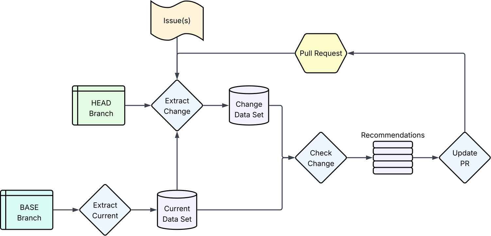
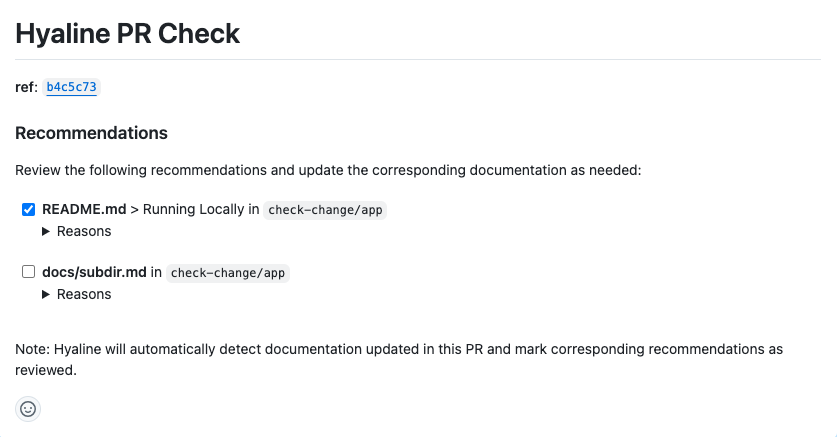

## Overview
Hyaline has the ability to create or update a comment on a GitHub PR with the results from a previous run of `check change`. When updating, it merges previous recommendations with new ones, as well as maintaining the status of items that have been addressed (either manually or via changes detected by `check change`). **Hyaline automatically detects when documentation changes are committed in the PR** and will check off corresponding recommendations in the PR comment.

The overall flow is `extract current` pulls code and documentation from the base branch to produce a current data set. `extract change` pulls code and documentation from the base branch, along with other change metadata, to produce a change data set. Both data sets are then used by `check change` to produce a set of recommendations. Those recommendations are then used by `update pr` to either add or update a comment on the GitHub Pull Request so humans can take appropriate action.

## Algorithm

The behavior of `update pr` depends on wether or not a pull request comment id is passed in. If one is not present Hyaline formats the contents of the comment based on the recommendations and creates a new comment on the pull request. If a pull request commend ID is passed in Hyaline will retrieve the comment and merge the recommendations and current state of any check marks into the set of newer recommendations to produce the merged set of recommendations that will be used for the comment. Hyaline then uses the merged set of recommendations to format the comment and then updates the existing comment.

The behavior of check marks on the comment depends on the state of the previous check mark and wether or not the documentation was marked as changed in the recommendations:

<table>
  <tr>
    <td></td>
    <td colspan="2"><b>Document or Section</b></td>
  </tr>
  <tr>
    <td><b>Previous Check Mark</b></td>
    <td><b>Changed</b></td>
    <td><b>Not Changed</b></td>
  </tr>
  <tr>
    <td><b>Not Present</b></td>
    <td>Checked</td>
    <td>Not Checked</td>
  </tr>
  <tr>
    <td><b>Not Checked</b></td>
    <td>Checked</td>
    <td>Not Checked</td>
  </tr>
  <tr>
    <td><b>Checked</b></td>
    <td>Checked</td>
    <td>Checked</td>
  </tr>
</table>

## Data Displayed

Hyaline places the following information into the Pull Request comment:

* The Git SHA that was passed in
* A list of recommendations where each one has:
  * A checkbox used to indicate that the recommendation for the document/section has been addressed
  * The name the document (and section if applicable)
  * The system and documentation source name
  * The list of reasons the documentation should be updated