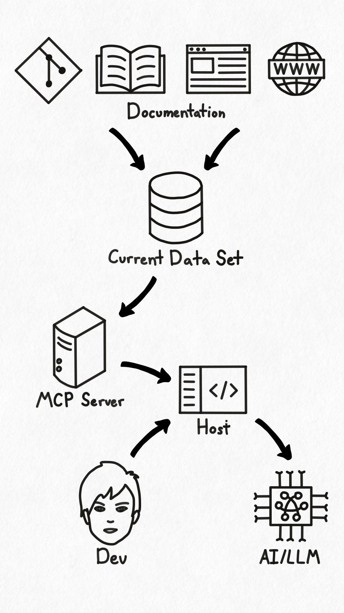
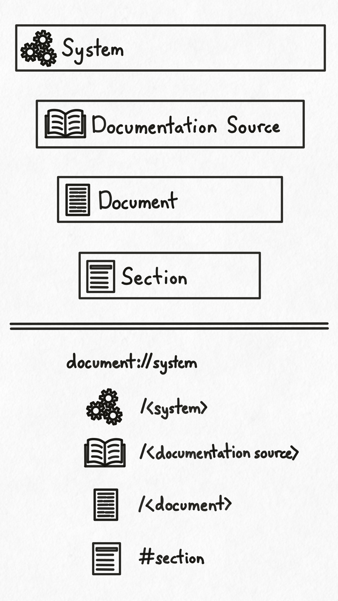

## Overview

Hyaline has a built-in MCP server that can make your documentation available to LLM models via the [Model Context Protocol](https://modelcontextprotocol.io/introduction) (MCP). First, you use Hyaline to [extract](./02-extract-current.md) all of your documentation into a current data set organized by system. This data set is stored in an SQLite database and can be sent, shared, or used independently of Hyaline if you wish. Once the current data set is complete you install Hyaline's MCP server in your host of choice (i.e. Claude Desktop) and point Hyaline to that data set. Once configured, your LLM will have the ability to list and retrieve all of your system documentation that is stored in your current data set. Then, when you as a developer ask your LLM to complete a task that requires documentation, your LLM can use the tools exposed by the MCP server via the host to list and retrieve relevant documentation.

Note that Hyaline's MCP server may be used with any system stored in the current data set, so it's up to you to inform the LLM which system(s) are applicable to your current query. Please visit the [MCP reference](../05-reference/06-mcp.md) for more detailed information on the tools made available by the MCP server.

## Concepts

### Organization

Hyaline extracts and stores documentation system by system as specified in the [configuration](../05-reference/01-config.md). Hyaline has the ability to store any number of systems, so it is up to you on how you would like to split up your documentation and have it stored.

Each system contains one or more documentation sources. These documentation sources are associated with a single group of documentation that is extracted together. For example, the documentation sources for a system could include 1) the development oriented documentation checked into the repository alongside the code (README and other markdown files), 2) operations oriented documentation stored in an internal wiki, 3) customer focused documentation stored on a website, etc...

Inside each documentation source is a set of documents. A document is either a single markdown file or html page that was discovered and saved during the extraction process. Additionally, Hyaline parses each document and extracts the section hierarchy, meaning that Hyaline can reference not just a specific document but also specific sections within the document.

### URIs

Hyaline constructs a URI to identify each extracted document and section. The format of the URI is `document://system/<system>/<documentation source>/<document>#<section>` and is constructed as follows:

- `<system>` is the ID of the system in the [configuration](../05-reference/01-config.md)
- `<documentation source>` is the ID of the documentation source in the [configuration](../05-reference/01-config.md)
- `<document>` is the ID of the document as extracted (the path to the document relative to the root of the documentation source) and may contain one or more path delimiters.
- `<section>` is optional and contains the name of the section. For sub-sections, the name of each parent section is prepended and separated by `#` (e.g. `#section1#subsection2`)

## Next Steps
You can go read the [MCP reference](../05-reference/06-mcp.md) to see details on the tools exposed by the MCP server, or go and view the [CLI reference](../05-reference/02-cli.md) to see how to run the MCP server.