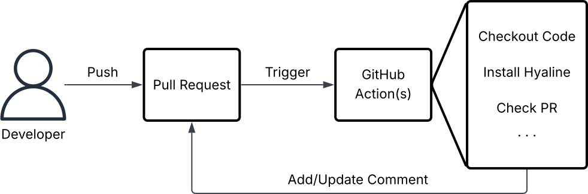
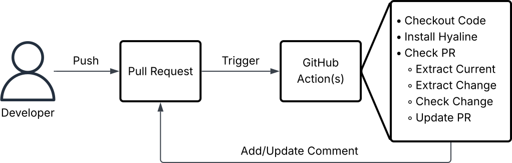

## Overview
Hyaline provides a set of [GitHub Actions](https://github.com/features/actions) that allows you to setup and use Hyaline within a GitHub workflow.



When a developer pushes code to a Pull Request in GitHub, one or more GitHub Actions are triggered. Those actions can then run jobs such as checking out code, installing Hyaline, checking that a pull request is updating all applicable documentation, etc.

## Setup
The [setup action](https://github.com/appgardenstudios/hyaline-actions/tree/main/setup) provides an easy way to download and install the Hyaline CLI on your GitHub Actions runner so you can run Hyaline commands.

The default configuration installs a hard-coded version of Hyaline that is updated alongside major Hyaline releases:
```yaml
steps:
  - uses: appgardenstudios/hyaline-actions/setup@v0
```

A specific version of the Hyaline CLI can be installed using:
```yaml
steps:
  - uses: appgardenstudios/hyaline-actions/setup@v0
    with:
      version: "YYYY-MM-DD-HASH"
```

### Inputs
The action supports the following inputs:

* `version` - (optional) The version of the Hyaline CLI to install. This version must be present as a tagged [GitHub Release](https://github.com/appgardenstudios/hyaline/releases) and must be later than `2025-05-26`.

### Outputs
This action is not configured to provide any outputs.

## Check PR
The [check-pr action](https://github.com/appgardenstudios/hyaline-actions/tree/main/check-pr) provides the ability to check a pull request.



When a developer pushes changes to a Pull Request a GitHub Action is triggered. That GitHub Action can then checkout the source code, install Hyaline, and use Hyaline to check the PR for documentation updates and recommendations (the results of which are added as a comment on the Pull Request).

Note that Hyaline will update (overwrite) older versions of its own comment so that you only have a single comment from Hyaline containing all of its recommendations.

This is a sample workflow file that will configure Hyaline to check your PRs when they are not in a draft state:
```yaml
on:
  pull_request:
    types: [opened, reopened, synchronize, ready_for_review]

jobs:
  check-pr:
    runs-on: ubuntu-latest
    # Only run if PR is NOT a draft
    if: ${{ github.event.pull_request.draft == false }}
    permissions:
      pull-requests: write
    steps:
      - name: Checkout repo
        uses: actions/checkout@v4
        with:
          fetch-depth: 0 # Needed to compare had and base branches
      - name: Setup Hyaline
        uses: appgardenstudios/hyaline-actions/setup@v0
      - name: Check PR
        uses: appgardenstudios/hyaline-actions/check-pr@v0
        with:
          config: ./hyaline.yml
          system: my-app
          repository: ${{ github.repository }}
          pr_number: ${{ github.event.pull_request.number }}
          github_token: ${{ secrets.GITHUB_TOKEN }}
        env:
          # Set env vars needed by the hyaline CLI when interpolating the hyaline config
          GITHUB_TOKEN: ${{ secrets.GITHUB_TOKEN }}
          ANTHROPIC_KEY: ${{ secrets.ANTHROPIC_KEY }}
```

Note that the `check-pr` job above requires the permission `pull-requests: write` to leave a comment on the pull request.

### Inputs
The action supports the following inputs:

* `config` - (required) The path to the hyaline configuration file relative to the root of the repository.
* `system` - (required) The system to use when extracting and checking the change.
* `repository`  - (optional) The current GitHub repository (owner/repo).
* `pr_number` - (required) The pull request number.
* `github_token` - (required) The GitHub token to use when reading and updating the PR's comments. This must have read/write to the repositories issues (because a pull request comment is actually an issue comment in GitHub).

### Outputs
This action provides the following outputs:

* `completed_recommendations` - The number of recommendations that have been checked and marked as completed.
* `outstanding_recommendations` - The number of recommendations that are unchecked and not marked as completed.
* `total_recommendations` - The total number of recommendations (sum of `completed_recommendations` and `outstanding_recommendations`)