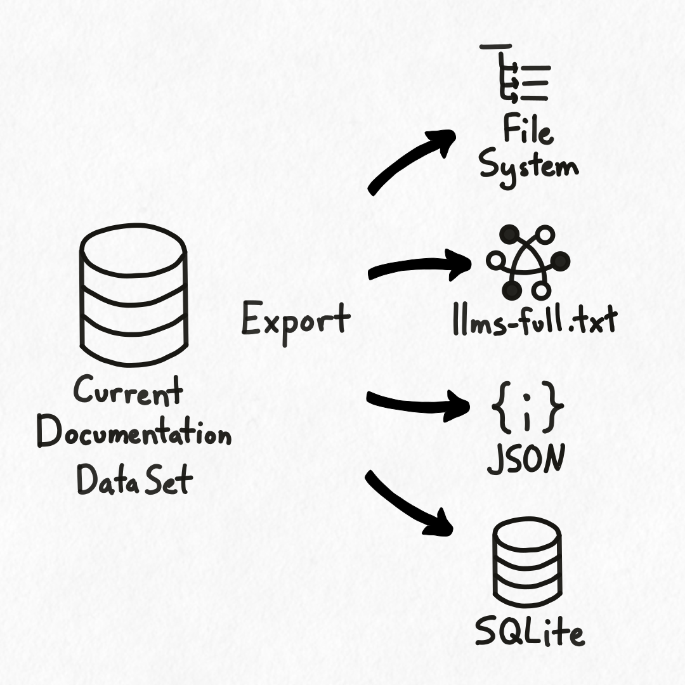

## Overview

Hyaline has the ability to export your extracted documentation into a variety of formats. You can use hyaline to generate a llms-full.txt file for use with internal libraries, output all your documentation to JSON for use in an external system, dump all your documentation to disk so you can publish or archive it, or simply use the export to get a filtered data set from your centralized extract as a SQLite database.

When you export you can include or exclude specific sources or documentation using a set of document URIs (see the `hyaline export` command in the [CLI Reference](../reference/cli.md) for more information).

Hyaline supports exporting documentation to the following formats:

### File System
The export format type `fs` will instruct Hyaline to export your documentation to a local file system. It will create a directory structure by source, and export each matching document into a file in the appropriate source directory.

### llms-full.txt
The export format type `llmsfulltxt` will instruct Hyaline to export your documentation into a single text file in a `llms-full.txt` format. Please see [Export](../reference/export.md) for more detail on this format.

### JSON
The export format type `json` will instruct Hyaline to export your documentation into a single JSON file. Please see [Export](../reference/export.md) for more detail on this format.

### SQLite
The export format type `sqlite` will instruct Hyaline to export your documentation into an SQLite database file. The format for this data is the same as the extracted documentation data set. Please see [Documentation Data Set](../reference/data-set.md) for more information on the database schema.

