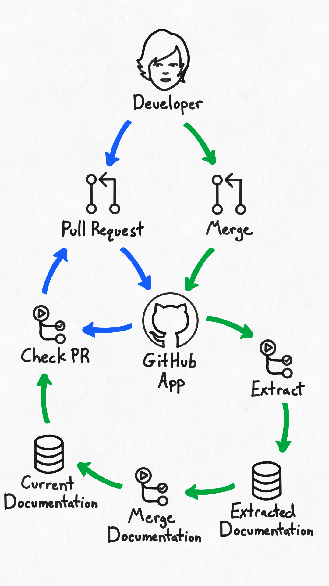
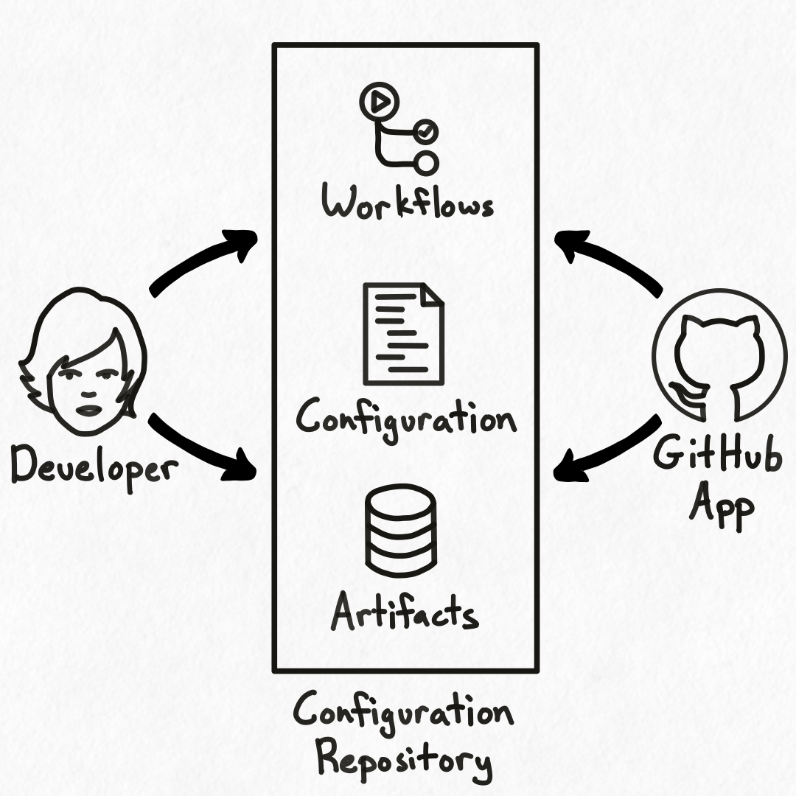

## Overview

Hyaline can be installed as a GitHub App that has two primary flows: Checking pull requests to recommend documentation updates and extracting documentation when changes are merged.

### Check PR
The check pull request flow, shown here in blue, starts with a developer opening a non-draft pull request against the default branch in a repository. The GitHub App is setup to receive this webhook event, and will dispatch a GitHub Action workflow to run a [check](./check.md) on the changes made in that pull request. This check uses the current documentation data set as an input to the check, as it contains all of the documentation that has been extracted for the organization. Hyaline then posts a comment with its documentation update recommendations back to the pull request for the developer to review. Each time the pull request is updated this cycle is triggered, and the pull request comment is updated.

Note that you can configure the GitHub App to ignore certain repositories if needed.

### Extract
The extract workflow, shown here in green, starts with a developer merging a pull request into the default branch of a repository. The GitHub App is setup to receive this webhook event, and will dispatch a GitHub Action workflow to run an [extract](./extract.md) for the repository. This extracted documentation is then [merged](./merge.md) into the full set of existing documentation so that Check PR and others have a data set containing the most recent extraction of all of the organizations documentation.

Note that you can download the current documentation data set from the configuration repository for use with the [MCP Server](./mcp.md) or for [export](./export.md).

## The Configuration Repository

The Hyaline GitHub App's configuration is stored in a GitHub repository in your organization or personal account (see [How To Install GitHub App](../how-to/install-github-app.md) for more information). This repository is where all of the workflows are run and artifacts are stored. This means that you have full access to and control of your data and the workflow actions run by Hyaline. The GitHub App comes with several build-in workflows, which include: 

### Doctor
The `Doctor` workflow that helps you check and keep your configuration up-to-date. It ensures the configuration is valid, opens a pull request for missing repositories, and keeps workflow inputs up-to-date as changes occur. You can run the doctor at any time, and if there are changes that need to be made the doctor will open a pull request in the configuration repository for you to review and merge in if desired.

### Manual - Extract All/Repo/Site
The `Manual - Extract All`, `Manual - Extract Repo`, and `Manual - Extract Site` workflows extract documentation using various configuration checked into the configuration repository.

The `Manual - Extract All` workflow will scan through the `repos/` and `sites/` directory and kick of an extract for each valid, non-disabled configuration it finds. It will (by default) trigger a merge workflow to merge the resulting extracted documentation together once the extractions are complete.

The `Manual - Extract Repo` workflow will extract a repositories documentation based on the configuration file in the `repos/` directory that has the same name as the repository. It will (by default) trigger a merge workflow to merge the resulting extracted documentation together once the extractions are complete.

The `Manual - Extract Site` workflow will extract a website's documentation based on the specified configuration file in the `sites/` directory. It will (by default) trigger a merge workflow to merge the resulting extracted documentation together once the extractions are complete.

### Manual - Run Audit
The `Manual - Run Audit` workflow runs an audit based on a configuration checked into the `audits/` directory in the configuration repository. It will output the results of the audit as an artifact and as an annotation on the run itself. 

### Internal
Workflows marked as internal are used by the GitHub app to check pull requests, extract documentation, merge extracted documentation together, and perform audits. You should usually run one of the manual workflows instead of running an internal workflow directly.

Note that the artifact created by the `Internal - Merge` workflow contains the merged current documentation data set, and can be downloaded and used with the [MCP Server](./mcp.md) or [exported](./export.md) into a variety of formats.

