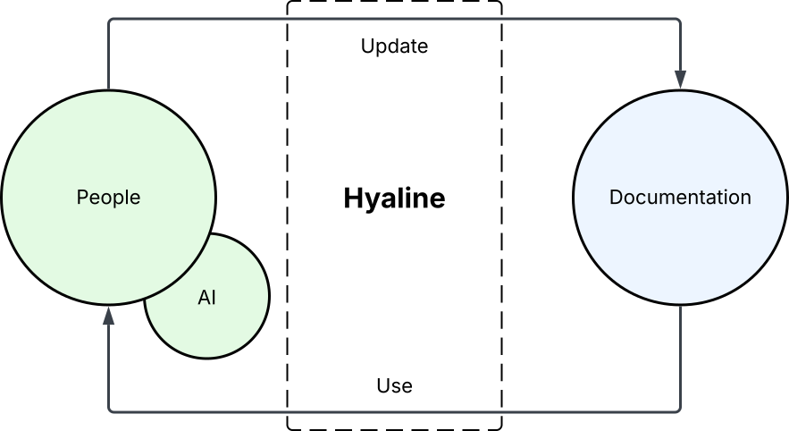
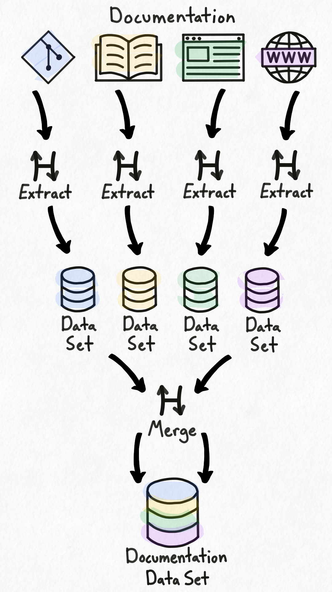
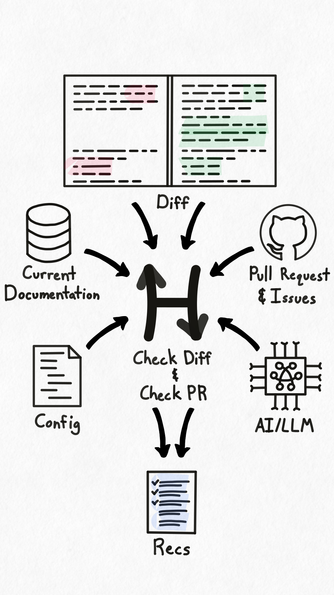
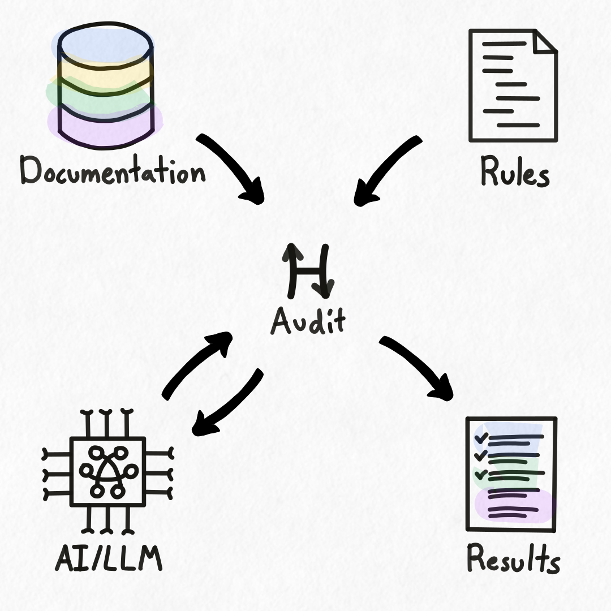
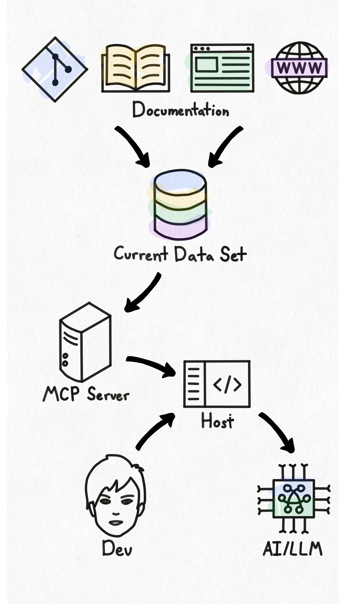

## Introduction
Hyaline is intended to help software development teams use their documentation to build and maintain their products. To that end Hyaline has two primary objectives: 1) help teams create, update, and maintain their documentation so that they can 2) use their documentation to create, maintain, and ship their products.

## Use Cases
To help you understand a bit more about what Hyaline does and does not do, consider the following:

**Use cases that Hyaline is intended to support**:
* Identify documentation that needs to be updated when a software change is implemented - Hyaline can examine your code changes and help identify what documentation needs to be updated and why
* Identify documentation that does not match its intended purpose or is incomplete - Hyaline can scan your existing documentation and ensure that each document and section matches your intended purpose and is complete.
* Ensure that certain documentation, including documentation that is required for regulatory or compliance purposes, is consistently created and maintained - Hyaline can be configured to use centralized rules to ensure certain documentation is present and updated across all of your products and systems.
* Allow an LLM to scan, search, and use your documentation to help you build your product(s) - Hyaline extracts and indexes all of your documentation, and makes that information available through an [MCP server](./mcp.md).

**Use cases that Hyaline is not intended to support**:
* Creating and/or updating documentation without human involvement - Hyaline is intended to _augment_ team members, not replace them.
* Extracting or storing 3rd party documentation such as API/Library documentation.

## Workflow

In this workflow people, assisted by AI, build products and systems. While doing so they create and update documentation. That documentation is then read and used by people to build products and systems, and the cycle continues. Hyaline sits in between people/AI and documentation, and is intended to assist in both creating/updating documentation and reading/using documentation to build products and systems.

## Extract

Hyaline has the ability to [extract documentation](./extract.md) from many different types of repositories and documentation sites. It supports extracting from local file systems, local or remote git repositories, and HTTP or HTTPS websites.

Each set of extracted documentation is considered a documentation source, and is stored by Hyaline in [an SQLite database](../reference/data-set.md). You can extract and store as many documentation sources as you wish, and each documentation source can be assigned metadata and tagged during the extraction process. Hyaline also separates out sections within a document, letting you be granular when using or updating each piece of documentation. 

This extracted documentation can be [merged](merge.md) into a single current documentation data set and used for a variety of purposes including: [checking code changes](./check.md) to determine what documentation may need to be updated, [auditing](./audit.md) the organization's documentation for compliance with regulations or internal processes, or using the documentation to develop products and systems via an [MCP server](./mcp.md).

However it is used, the documentation extracted by Hyaline helps you both use your documentation and keep it up to date.

## Check

Hyaline has the ability to [check](./check.md) code changes and recommend documentation updates based on the code that was updated. To support this process Hyaline utilizes several resources to provide recommendations:

**Code Diffs**: Hyaline examines each piece of code that was changed to determine what documentation may need to be updated based on each change.

**Current Documentation**: Hyaline uses the entire set of current documentation when determining which documentation may need to be updated for a code change.

**Pull Request and Issues**: Hyaline can pull in a pull request and one or more issues to provide additional context when evaluating potential documentation updates.

**Configuration**: Hyaline provides fine-grained control over what code and documentation to consider, and provides the ability to directly link code to relevant documentation using “Update If” statements.

**AI/LLMs**: Hyaline uses an LLM to help determine what documents should be updated for each code change. This information goes from you to your configured LLM directly, and we do not see or process your code or documentation in any way.

Hyaline supports checking the difference between two local branches or the code changes in a PR. It can be configured to run locally or in a CI process such as GitHub Actions to provide critical insight into what documentation may need to be updated across your organization.

However you choose to configure Hyaline, it helps you keep your documentation accurate and up-to-date.

## Audit

Hyaline has the ability to audit your current set of documentation based on a set of rules and checks. Using Hyaline, you can ensure that your documentation contains the information necessary to comply with industry regulations or internal compliance rules. You can also check for consistency in documentation across all of your products and systems.

It is up to you to decide what and when to audit, but when you do Hyaline is there to help.

## MCP

Hyaline comes with a built-in MCP server that makes your documentation available to LLM models via the [Model Context Protocol](https://modelcontextprotocol.io/) (MCP). MCP is a standardized mechanism to provide LLMs and AI systems the context they need to do their job.

To use Hyaline's MCP server you first use Hyaline to [extract](./extract.md) and [merge](./merge.md) all of your organization's documentation into a documentation data set. Once complete, you then install Hyaline’s MCP server in your host of choice (i.e. Claude Desktop) and configure Hyaline to use your current documentation data set. Once installed, your AI assistant has the ability to list and retrieve all of your organization's documentation. Then, when you ask your LLM to complete a task that requires documentation, your LLM can use the tools exposed by Hyaline's MCP server to list and retrieve relevant documentation.

Regardless of the type of documentation your organization maintains, Hyaline can help you use that documentation when leveraging AIs and LLMs to help build products and systems.

## Next Steps
Continue reading about various Hyaline concepts such as [extract](./extract.md), or get started by visiting [getting started](../getting-started.md).