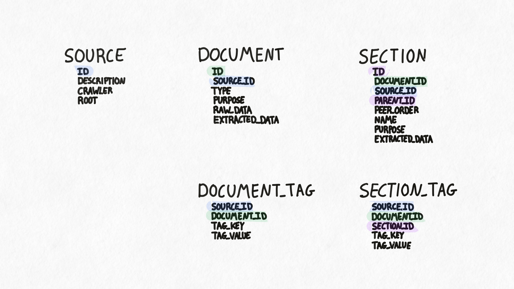

## Overview
This documents the database schema of the Hyaline Documentation Data Set as generated by the command `hyaline extract documentation` and stored in sqlite.

## Tables
<!-- purpose: Document all database tables and their structure -->
The following tables make up a Hyaline Documentation Data Set.

### SOURCE
The Documentation Source, along with some metadata.

- **ID** - The source ID, pulled from the configuration. This must be globally unique and match the regex `/^[A-z0-9][A-z0-9_-]{0,63}$/`.
- **DESCRIPTION** - A description of the source, used for informing the llm about the purpose and contents of the documents and sections contained within this source. May be blank.
- **CRAWLER** - The type of the extractor. One of `fs`, `git`, `http`.
- **ROOT** - The "root" of this documentation source. The document's path should always be relative to this root. ROOT is used during the check diff/pr process to determine which documents and/or sections have been updated. Must not be blank.

**Primary Key**: (ID)

### DOCUMENT
A document.

- **ID** - The ID of the document, determined by the path to the document relative to the root of the source (`SOURCE.ROOT`). Must be unique within the source. Must not be blank.
- **SOURCE_ID** - The ID if the source this document belongs to. Points to `SOURCE.ID`.
- **TYPE** - The type of document. One of `md`, `html`.
- **PURPOSE** - The purpose of this document. Set via metadata during the extraction process. May be blank.
- **RAW_DATA** - The raw document in its original form. May be blank.
- **EXTRACTED_DATA** - The markdown representation of the document after being fully extracted. May be blank.

**Primary Key**: (ID, SOURCE_ID)

### SECTION
A section within a document.

- **ID** - The ID of the section, determined by the path to the section relative to the root of the document (`Section 1 > Section 1.1` becomes `Section 1/Section 1.1`. Note that slashes (`/`) are replaced with `_` in the section names during extraction. Must be unique within the source. May not be blank.
- **DOCUMENT_ID** - The ID if the document this section belongs to. Points to `DOCUMENT.ID`. Must not be blank.
- **SOURCE_ID** - The ID if the source this document belongs to. Points to `SOURCE.ID`. Must not be blank.
- **PARENT_ID** - The ID if the section this section belongs to. Points to `SECTION.ID`. Must not be blank.
- **PEER_ORDER** - The order of the section in relation to its peers. 0-based. Must not be blank.
- **NAME** - The original name of the section (including any `/`). May be blank (if section name is empty).
- **PURPOSE** - The purpose of this section. Set via metadata during the extraction process. May be blank.
- **EXTRACTED_DATA** - The markdown contents of this section. Note that any child sections are included in this data. May be blank.

**Primary Key**: (ID, DOCUMENT_ID, SOURCE_ID)

### DOCUMENT_TAG
A tag associated with a document.

- **SOURCE_ID** - The ID if the source this tag belongs to. Points to `SOURCE.ID`. Must not be blank.
- **DOCUMENT_ID** - The ID if the document this tag belongs to. Points to `DOCUMENT.ID`. Must not be blank.
- **TAG_KEY** - The value of the key for this tag (aka the tag name). Must match the regex `/^[A-z0-9][A-z0-9_-]{0,63}$/`. Note that the prefix `_` is reserved for internal use if needed in the future.
- **TAG_VALUE** - The value of this tag (aka the tag value). Must match the regex `/^[A-z0-9][A-z0-9_-]{0,63}$/`.

**Primary Key**: (SOURCE_ID, DOCUMENT_ID, TAG_KEY, TAG_VALUE)

**Index**: (TAG_KEY, TAG_VALUE)

### SECTION_TAG
A tag associated with a section.

- **SOURCE_ID** - The ID if the source this tag belongs to. Points to `SOURCE.ID`. Must not be blank.
- **DOCUMENT_ID** - The ID if the document this tag belongs to. Points to `DOCUMENT.ID`. Must not be blank.
- **SECTION_ID** - The ID if the section this tag belongs to. Points to `SECTION.ID`. Must not be blank.
- **TAG_KEY** - The value of the key for this tag (aka the tag name). Must match the regex `/^[A-z0-9][A-z0-9_-]{0,63}$/`. Note that the prefix `_` is reserved for internal use if needed in the future.
- **TAG_VALUE** - The value of this tag (aka the tag value). Must match the regex `/^[A-z0-9][A-z0-9_-]{0,63}$/`.

**Primary Key**: (SOURCE_ID, DOCUMENT_ID, SECTION_ID, TAG_KEY, TAG_VALUE)

**Index**: (TAG_KEY, TAG_VALUE)